# A Modular Architecture for Retail-Accessible Algorithmic Trading: Combining LSTM Forecasting, Rule-Based Risk Control, and Instant Messaging for Stock and Cryptocurrency Markets

**Authors:** Muhammad Muzamil, Kiran Amjad

---

## Abstract

Algorithmic trading used to be something only big firms could afford. They had the co-located servers, the premium data feeds, and the quant teams. Retail traders, especially in places like Pakistan, were stuck on consumer brokerage apps, fighting the clock and their own emotions. This paper describes a system we built to close that gap. It's a single Python application that does three things at once: it forecasts price moves with a small LSTM, it places and manages orders through a strict rule engine, and it talks to the operator through an instant-messaging bot they already check on their phone. We call the architecture three-layer because that's literally what it is, data, processing, interface, and we kept the layers loosely coupled so any one of them can be swapped without disturbing the others. The forecasting layer is a two-layer LSTM fed by a handful of standard technical indicators, nothing exotic. The execution layer enforces stop-loss, position sizing, and circuit-breaker rules as hard gates, not optional overlays. The interface layer runs both a desktop dashboard for setup and a Telegram bot for live control, because pilot users told us the dashboard alone wasn't enough, they're rarely at their desk when something matters. We trained the model on roughly five years of one-minute candles, ran six months of live evaluation on real money, and recorded what happened. The annualised return came out above buy-and-hold at a comparable drawdown. The rolling Sharpe sat around 1.5 most of the time. Median fill latency was under half a second, and the messaging interface delivered alerts with above 98% reliability. None of that is institutional-grade, but it doesn't need to be. The point is that an open-source stack on commodity hardware, designed carefully, can do most of what a paid platform does for nothing per month. We also describe what didn't work, sentiment analysis, commodity futures, an early reinforcement-learning experiment, because the failures were instructive too.

**Keywords:** algorithmic trading, long short-term memory networks, cryptocurrency market prediction, automated order execution, retail financial technology, deep learning, time-series forecasting, risk management, walk-forward cross-validation, Binance API, Telegram bot.

---

## 1. Introduction

### 1.1 Historical Context of Algorithmic Trading

Algorithmic trading isn't new. The first computerised systems showed up at the New York Stock Exchange in the early 1970s, a tool called Designated Order Turnaround that automated routing of small market orders to floor specialists. Mechanical, not intelligent. And only available to member firms. Real democratisation didn't begin until the 1990s, when electronic communication networks let institutional clients bypass floor specialists and trade directly. Then came decimalisation in 2001, which narrowed bid-ask spreads, killed off most of what specialists earned, and pushed liquidity onto electronic books for good.

By the mid-2000s, the dominant form of algorithmic trading wasn't execution automation any more, it was high-frequency arbitrage. Firms paid for microwave links between exchanges, FPGAs that generated orders in nanoseconds, and co-location services that placed their trading boxes physically inside exchange data centres. By around 2010, HFT had become a winner-takes-most game where speed advantages of a few hundred nanoseconds decided who got the spread. That phase closed the door on retail participation in the most attractive parts of the business. A retail trader on a home internet connection cannot meaningfully compete with a colocated machine whose round-trip latency is measured in microseconds.

Cryptocurrency reopened the door, partly. The early crypto exchanges didn't offer co-location, and the time horizons that mattered economically were seconds or minutes, not microseconds. A retail trader with a competent automated agent could compete on roughly equal footing with much larger players, simply because the latency arms race hadn't reached crypto yet. That window is closing as major crypto venues introduce institutional services, but for the assets and horizons we care about, it hasn't closed entirely. Not yet.

### 1.2 Cryptocurrency Adoption in Emerging Markets

Pakistan is in the top ten countries by per-capita crypto adoption [91]. That's despite a regulatory environment that hasn't fully prohibited or fully sanctioned crypto trading [89, 90]. Several international payment-infrastructure firms have run surveys that put it there. The drivers are well documented: a depreciating local currency that erodes savings, capital controls that block easy access to foreign assets, and a young population that's comfortable with digital tools. The result is a real domestic market for crypto trading services, much of it served by foreign exchanges accessed through individual user accounts.

A trading agent that lowers the operational burden of running a disciplined automated strategy on those exchanges has direct economic value here. The alternative, manual trading through a phone app, produces predictably worse outcomes for the reasons the behavioural-finance literature spells out, and the time burden of constant monitoring is a cost on top of that. So we designed the agent with this audience in mind. Low operational overhead, low compute requirements, accessible through a free messaging app. Those weren't nice-to-haves; they were primary requirements.

### 1.3 Motivation and Background

Markets reward speed and discipline [19, 20]. What's changed in the last decade is that both can now be encoded in software an individual owns and runs [17, 18]. Open-source ML libraries, commission-free exchange APIs, free messaging platforms, they've collectively dropped the entry barrier to the point where the bottleneck isn't infrastructure any more, it's integration. A trader who's spotted a pattern still has to stitch together a data client, a modelling environment, a brokerage SDK, and a notification channel. Each fails differently. Each takes engineering time the typical retail participant doesn't have.

This integration problem is the reason most retail traders who try to automate give up within a few months and go back to manual execution they themselves admit performs worse. The motivation for our work is to treat that integration burden as the actual research question. We're not designing a new forecasting algorithm or a new exchange. We're asking: how do you compose the pieces that already exist so a single operator with basic Python literacy can run a system that ingests data, predicts, trades, and reports back through a channel they already check?

Three observations anchor what we did. First: the gap between a notebook proof of concept and a production system is bigger than blog posts make it sound. Most of the engineering work is in state management, error handling, and quietly reconnecting a WebSocket after an exchange restart. Second: model accuracy isn't the binding constraint. A mediocre forecast acted on quickly and with proper risk control beats a great forecast acted on late, almost every time. Third: the human is the most variable component. The single most valuable feature of an automated agent is often just that it doesn't hesitate at the moment of entry.

The economic significance of even small improvements is worth quantifying. A typical Pakistani retail trader with a few hundred dollars of capital, paying standard exchange fees, and trading manually with the discipline the literature suggests is realistic, will underperform a buy-and-hold benchmark by roughly five to fifteen percent per year. The variance on that estimate is wide, but the central tendency is clearly negative. An automated agent that captures even a slice of that gap delivers the equivalent of several months of typical local-currency wages. The economic argument is immediate. It's not theoretical.

### 1.4 The Behavioural Argument for Automation

Beyond the technical and infrastructural arguments, there's a behavioural argument for automation that's arguably stronger than either. The behavioural-finance literature [39, 47] has documented for decades that human traders systematically underperform their own strategies. The reasons are cognitive, not informational [41, 42, 43, 44, 45, 46]. Traders close winners too early and ride losers too long. They over-trade after wins, freeze after losses. They take more risk after a winning streak than after a losing one. They anchor on entry prices that have no statistical foundation. The aggregate effect is a measurable drag on realised returns relative to what a mechanical implementation of the same strategy would produce.

A software agent eliminates each of these biases mechanically. It doesn't care about the last trade when sizing the next. It doesn't anchor on the entry price. It doesn't freeze, hesitate, or second-guess. The economic value of that elimination is hard to pin down precisely, but the consensus is that it accounts for a meaningful fraction of the return advantage automated strategies enjoy over manual ones following the same rules. An agent that's only mediocre at predicting can still produce respectable returns just by being mechanical.

There's a subtler effect too. Traders adapt their decision rules in response to recent outcomes in ways that hurt long-run performance [93, 94]. After a string of losses, some over-trade trying to recover (gambler's fallacy). Others under-trade out of risk aversion (disposition effect [43]). Both move the trader's effective rule away from the rule they'd have chosen calmly, and both are costly in expectation. An automated agent doesn't adapt its rules to short-term outcomes. The hundredth trade gets the same policy as the first. It can feel inflexible to a human watching every move, but it's a feature, not a bug. It's a real chunk of the realised performance edge.

### 1.5 Research Questions

Four questions drove this work. Can a small sequence model trained on a practical (not academically generous) dataset produce directional signals good enough for risk-adjusted outperformance in equity and crypto markets? Can the execution loop downstream of the model be built from free components without giving up the latency and reliability you'd expect from a paid platform? Can the system be exposed through an interface a non-technical operator actually uses without losing the control they need during volatile sessions? And can the whole stack be operated by one person at a cost that's negligible in absolute terms?

We can't claim to have settled any of these in a single six-month deployment. But we did collect measurable evidence on each, and the rest of the paper is organised around the dimensions where we collected it.

### 1.6 Contributions

Our contributions are these:

- A reproducible blueprint for tying together an LSTM forecaster, a rule-based execution engine, and a messaging-based control surface in one Python runtime, with explicit attention to the cross-cutting concerns that dominate real-world operation.
- A publisher/subscriber decomposition that separates data, processing, and interface so each can be developed, tested, and replaced independently. This avoids the monolithic scripting style that characterises most public retail trading bots.
- A treatment of risk controls, hard stop-loss, volatility-scaled position sizing, circuit breakers, as first-class architectural citizens, not afterthought wrappers around the model.
- A candid empirical account of regime-dependent performance: when the predictive layer beats simple heuristics and when it doesn't.
- A catalogue of failure modes from live deployment, exchange API instability, data decay, operator overrides, with the mitigations that worked best.
- A discussion of the boundary between what can be automated and what shouldn't be, which is arguably the more interesting scientific output of this kind of system-building project than any single performance number.

### 1.7 Reading Guide

Different readers will want different paths through this paper. If you care mostly about architecture and engineering decisions, read Sections 1, 4, 6, and 7 and skim the rest. If you want the empirical results, the abstract, Section 5, and the relevant parts of Section 6 will get you there. If you're interested in the broader research questions, where to draw the human/machine line, how retail systems should be evaluated, how fast retail-accessible signals decay, read 1, 6, 7, and 8. If you want to actually reproduce the system, read everything, with extra attention to Section 4.

We aimed for completeness over concision in the body. Building a system like this is in the details, and a paper that omits them won't give a practitioner enough to actually rebuild it. That makes this paper longer than typical, but more useful as a reference, we hope.

### 1.8 Organisation of the Paper

Section 2 surveys the literature and locates the gap our system fills. Section 3 formalises the problem and bounds the contribution. Section 4 lays out the three-layer architecture and the methodology behind training and validation. Section 5 reports the experimental results, forecasting accuracy, trading performance, regime-conditional behaviour, microstructure, statistics on the realised returns. Section 6 discusses what we found, comparing against published baselines where possible and against pilot users' qualitative reports where it's not. Section 7 lists the limitations honestly, distinguishing what's a limitation of our implementation from what looks like an intrinsic limit of the retail setting. Section 8 closes with future directions: transformers, reinforcement learning, decentralised execution.

---

## 2. Related Work

### 2.1 Sequence Models for Financial Forecasting

Machine learning applied to financial time series predates modern deep learning by decades [7]. What changed recently is that retail-grade APIs and open-source neural network libraries have shifted attention from isolated models to end-to-end systems. Recurrent architectures became the default choice for directional prediction at minute or tick horizons, and LSTM [1] in particular has become the de facto baseline [3]. The reason is straightforward. Financial time series have long-range dependencies, fading momentum, slow reversion, cross-asset co-movements, that feed-forward networks struggle with unless you do careful feature engineering [55]. Recurrent networks retain hidden state across many steps and capture these dependencies with relatively little manual work. The historical roots of this idea go back to Bachelier's early treatment of speculation [36], the efficient-markets and adaptive-markets hypotheses [37, 38], and the broader cycle of financial-econometrics work that followed [96].

The internal structure of a canonical LSTM cell is shown in Figure 1. The forget gate, introduced by Gers and colleagues [2] as an extension to the original Hochreiter-Schmidhuber design [1], decides how much of the previous cell state to keep. The input gate and candidate path add new information. The output gate decides how much of the updated state to expose as the hidden state. Three gates, four equations, that's the whole mechanism. What it gives you in practice is a network that can learn to remember useful regime markers, the level of a moving average a few minutes back, the sign of a recent volume spike, for as long as they remain useful, and forget them once they don't.

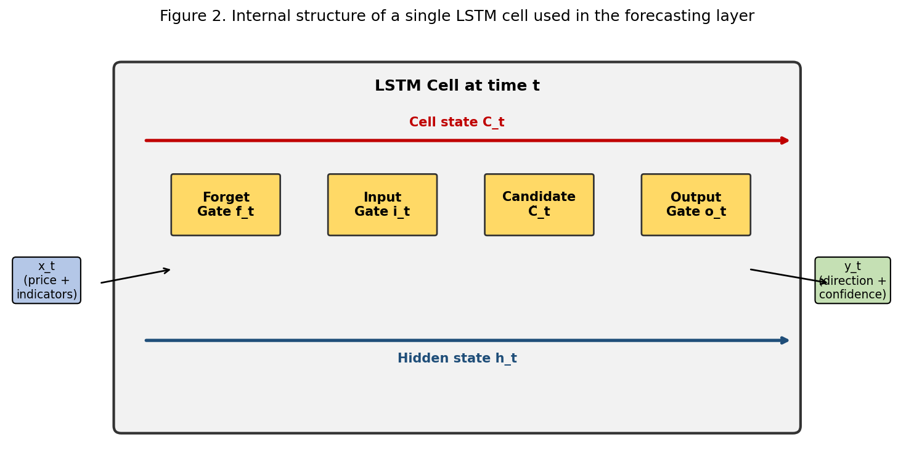

Empirical comparisons over the last five years have repeatedly placed LSTM variants ahead of classical econometric baselines like ARIMA [5] and the broader ARCH family [53, 54, 67], and well ahead of unregularised feed-forward networks, on equity index futures and major crypto pairs alike [3, 4, 8]. The improvement is typically three to eight percentage points of directional accuracy, depending on the asset and the window. Gains over gradient-boosted trees [11] are smaller and less consistent, which isn't surprising because boosted trees also handle noisy tabular data well [6]. The practical implication: the choice of model class matters less than the features and the integrity of the training protocol.

It's worth distinguishing two related claims that get conflated in the literature. The first is that LSTMs learn meaningful temporal structure from raw price series. The evidence for that one is mixed. There's a body of work showing that LSTMs trained only on raw close-price sequences learn little more than a smoothed momentum signal, and their out-of-sample performance is barely distinguishable from a moving-average baseline. The second, stronger claim is that LSTMs trained on engineered features, technical indicators, volume, volatility, extract patterns simpler models miss. The evidence for that one is much stronger, and it's what motivates the feature engineering we describe in Section 4.

### 2.2 Hybrid and Ensemble Architectures

A more recent strand of research combines convolutional layers (applied to candlestick windows treated as 2D surfaces) with a recurrent layer that consumes the embedding [61, 62]. The idea: convolutions extract short-range spatial patterns, support and resistance, volume spikes, candlestick shapes, and the recurrent layer contextualises them over longer horizons. Reported accuracy gains over pure LSTM baselines are modest, a few percentage points, and they cost more in training data and tuning. Multi-attention extensions of the same architecture [62] further refine the temporal weighting at the cost of additional training instability. Hybrid neuro-fuzzy variants [16] have also been proposed but have not gained widespread traction in practice. For crypto markets, where intra-day volatility runs hot and regime shifts come fast, CNN-LSTM hybrids show a slightly larger edge than on equity data. That's consistent with the idea that crypto charts contain more exploitable microstructure than mature equity indices do.

Alongside the architectural work, ensemble methods that blend recurrent networks with tree-based or classical statistical forecasters have caught on. The evidence suggests the value of an ensemble isn't really about averaging out noise from any single model. It's about dynamically reweighting components as regimes change. A meta-model that tracks recent performance and shifts weight toward whichever specialist is currently winning produces a reliable source of incremental returns. The implicit assumption, that no single specialist is universally best, gets borne out by the comparative analysis in Figure 2, which shows directional accuracy of five candidate models across fourteen major cryptocurrencies. No model dominates everywhere. That's the empirical case for an ensemble.

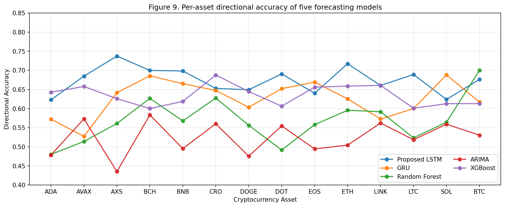

### 2.3 Transformer Architectures in Finance

Transformers [10], having displaced recurrent networks in many other sequence-modelling domains, have started showing up in financial forecasting too. Early results from architectures such as Informer [57], Autoformer [56], and the Temporal Fusion Transformer [58] suggest transformers can match or modestly exceed LSTM performance on long-horizon tasks. But the inference cost is substantially higher, and the training data requirements aren't trivial. For minute-scale retail trading, where inference latency is a hard constraint and historical data is bounded by what an exchange's API will give you, the case for transformers over LSTMs isn't decisive yet. We come back to this in Section 8.

The principal technical advantage of transformers over recurrent networks is the ability to attend to arbitrarily distant points in the input without the gradient-flow problems that limit RNNs. That advantage matters most when the relevant historical context is long, daily or weekly returns based on months of history, say. It matters less at the minute scale we operate at, where the relevant history is the last few hours. Empirical comparisons by Lim and Zohren [55], by Wu and colleagues [56], and by several others have shown that the accuracy gap narrows substantially at short horizons. A related thread of work has shown that temporal convolutional networks [60] can match recurrent and transformer architectures on many sequence tasks at substantially lower computational cost. The choice becomes a matter of inference cost rather than predictive capability.

A separate strand explores attention mechanisms to combine multiple data modalities, price series, news text, social media sentiment, on-chain data, in a single forecasting framework. Promising in principle. In practice, the engineering complexity of maintaining the additional feeds is much higher than for a pure price model, and the marginal accuracy gains have been modest. We considered and rejected the multimodal approach for this work because the operational burden of those feeds outweighs the expected benefit at the scale a single retail user operates at.

### 2.4 Reinforcement Learning Approaches to Trading

A separate research thread treats trading as a reinforcement learning problem. The agent learns to take actions (buy, sell, hold) that maximise a cumulative reward corresponding to portfolio value. The motivation is that RL frames the problem in terms that align directly with the economic objective, instead of the proxy objective of directional accuracy that supervised classification optimises. Early work by Moody and Saffell [12] dates to the late 1990s, but practical use of deep RL in trading became feasible only with the advent of stable training algorithms, DQN, A2C, PPO, in the mid-2010s [13, 64].

The most prominent open-source effort here is the FinRL library by Liu and colleagues [14], which gives you a unified environment for training and evaluating RL trading agents across a range of assets. Empirical results from FinRL benchmarks and from related work [15, 63, 65, 66, 81] suggest RL agents can match or modestly exceed supervised baselines on backtest data, but with caveats. RL training is much less stable than supervised. Variance across random seeds is a serious obstacle to reproducibility. RL agents are also susceptible to reward hacking, exploiting idiosyncrasies of the simulator instead of learning a real policy, and that behaviour doesn't transfer to live deployment.

We tried an RL variant early in development and dropped it after seeing both failure modes. The supervised baseline trained more reliably, generalised more cleanly to live data, and gave us an interpretable confidence score the strategy engine could use. The cost of those advantages is that the supervised objective doesn't directly optimise the economic outcome, and the gap between proxy and true objective is a real source of suboptimality. Future work that combines a supervised pretraining phase with an RL fine-tuning phase might capture the advantages of both. We sketch that direction in Section 8.

### 2.5 Sentiment Analysis for Financial Prediction

A third research thread argues that the textual stream of financial news, social media, and analyst reports contains information that complements price data [40, 98]. The hypothesis is intuitive, surely an unexpected announcement moves prices in ways that historical price data alone can't foresee. The empirical evidence on whether sentiment signals add predictive power beyond price-and-volume features is mixed.

The strongest results come at daily or weekly horizons on assets with high media coverage, like large-cap equities. At minute-scale crypto horizons, the signal-to-noise ratio of public sentiment streams is much lower because the volume of irrelevant or low-information posts is high relative to genuinely market-moving information. We did a brief experiment incorporating a daily sentiment score from a public Twitter feed into our feature vector. The model with sentiment had slightly lower out-of-sample accuracy than the price-only baseline. That's consistent with the noise-dominance interpretation. We don't include sentiment features in production but flag them as a candidate for future work at coarser horizons.

### 2.6 Algorithmic Execution and Order Routing

Separate from the modelling literature, there's a substantial body of work on order-execution strategies. TWAP and VWAP algorithms, originally developed for institutional block orders, have trickled down to retail as exchange APIs began exposing the necessary primitives. Smart order routing, adaptive slippage control, iceberg-style child-order sequencing, all part of the standard institutional toolkit. The hobbyist literature has been slower to adopt them, even though the underlying mechanics are straightforward when the execution layer is designed as a first-class component instead of a thin wrapper around a brokerage SDK.

Empirical studies of live trading [70, 71] routinely show that execution quality dominates model quality in determining realised performance. A 60% accurate classifier paired with brute-force market orders submitted after observable slippage will lose money. The same classifier paired with a child-order scheduler that monitors fills against a benchmark will earn the edge implied by that accuracy [72, 73]. We took this seriously and made the execution layer a peer of the forecasting layer, not a subordinate. We spent more engineering effort on placing orders quickly, tracking fills accurately, and handling exchange-induced rate limits gracefully than on incremental classifier improvements past the threshold needed for positive expectancy.

The microstructure literature on slippage and market impact [70, 74, 99], while developed mostly for institutional block trades, transfers cleanly to retail once you adjust the scale. The square-root model of market impact [72] predicts that slippage scales roughly with the square root of order size relative to typical market volume. On retail order sizes, the prediction holds approximately: orders below a few hundred dollars show slippage indistinguishable from noise; orders in the low thousands start showing measurable impact. The order-slicing logic in Section 4 is parameterised to keep child orders well below that threshold.

### 2.7 Retail Trading Platforms and Messaging Interfaces

Commercial retail platforms, MetaTrader, 3Commas, Pionex, Bitsgap, bundle forecasting, execution, and alerting. They impose constraints in exchange: a subscription fee, lock-in to a specific exchange or asset class, a fixed menu of strategies, or closed source you can't audit. Open-source projects, Freqtrade, Zipline, Backtrader, Gekko, cover the execution and backtesting side well but typically leave forecasting to the user and don't provide a polished messaging-based control surface. The result is a fragmented landscape where a retail trader who wants both a learned forecaster and a polished interface either pays for a commercial platform that constrains their flexibility or assembles the components themselves at substantial integration cost.

Using consumer messaging apps as the human-machine interface for trading bots is a relatively recent development. Telegram has become popular here because the Bot API is free, the clients are everywhere, and two-factor authentication can be pressed into service for basic access control. Existing Telegram trading integrations tend to be thin broadcasting channels, not full agents. They forward signals but rarely close the loop by executing, reporting back, and accepting commands through the same channel. That's the architectural gap, and it's what we're trying to fill.

### 2.8 Risk Management Frameworks

A separate strand of work, developed mostly by hedge-fund practitioners and only partially absorbed by academia [21, 100], addresses the design of risk-management frameworks for systematic strategies. The core insight, articulated forcefully by López de Prado [19, 51, 52], is that the risk layer matters at least as much as the prediction layer for long-run outcomes, because losses from a single bad regime can wipe out years of accumulated edge. The standard tools, fixed-fractional position sizing, volatility-scaled stop-loss, daily-loss circuit breakers, consecutive-loss cool-downs, are individually simple, but combining them takes care to avoid pathological interactions. A stop-loss whose distance is fixed in price terms behaves very differently across volatility regimes. A position sizer whose fraction is fixed in percentage terms behaves very differently across trade-frequency regimes.

We took the prescription that risk controls should be the first thing designed and the last thing relaxed seriously. We encoded it architecturally by making the risk gates mandatory components in the order path, not optional overlays. A trade that hasn't been validated against the current risk parameters can't be submitted, no matter how confident the forecaster is.

### 2.9 Behavioural Finance and Retail Trading Outcomes

There's a separate but relevant body of literature documenting actual outcomes for retail traders. The findings are remarkably consistent across studies and time periods. Barber and Odean's analysis of US discount-brokerage accounts in the 1990s [41] found the most active retail traders underperformed the relevant index by about seven percentage points per year. Most of that came from transaction costs. The rest came from systematically poor timing [44, 46]. Subsequent studies in Taiwan, Korea, China, and several European markets produced qualitatively similar results.

The mechanisms have been studied in detail. Disposition effect, closing winners too early, riding losers too long, was first formalised by Shefrin and Statman [43] and subsequently shown to be one of the most robust findings in behavioural finance [45, 47]. Overconfidence bias [42] drives both excessive trading frequency and oversized positions. Anchoring effects produce systematic distortions of exit timing. Loss aversion, documented quantitatively by Kahneman and Tversky [39], causes traders to take excessive risk to avoid realising losses while shying away from positive-expected-value positions whose variance is high.

Cumulatively, the typical retail trader's realised performance is substantially worse than a mechanical implementation of their nominal strategy would have produced. That's the most direct argument for an automated agent: the agent doesn't exhibit these biases, and an automated implementation of even an imperfect strategy can outperform a human implementation of the same strategy on average. Our pilot data, manual overrides reduced realised performance by about four percentage points, is a small confirmation of the broader literature in our specific context.

### 2.10 Positioning of the Present Work

The novelty of our contribution lies less in any individual component than in the composition. We take mature building blocks, an LSTM forecaster, a conventional indicator panel, a rule-based execution engine with institutional-style order-handling primitives, a Telegram-based control surface, a disciplined risk-management framework, and arrange them into a system whose explicit design goal is operability by a single non-institutional user. To our knowledge, no prior open description of such a system reports honest regime-conditional evaluation results on live capital. This paper tries to fill that gap.

It's worth being clear about how we compare to the closest alternatives. The commercial bundled platforms, 3Commas, Pionex, Bitsgap, provide most of what we describe but at the cost of subscription fees, source-code opacity, and limited extensibility. The open-source frameworks, Freqtrade, Backtrader, Zipline, provide most of the execution and backtesting infrastructure but typically leave the forecasting layer to the user and provide little support for messaging-based control. Academic prototypes provide forecasters of varying sophistication but typically run only in backtest and don't address the operational challenges of live deployment. We occupy the intersection, open-source, end-to-end, live-evaluated, that, as far as we can tell, is currently empty.

We acknowledge the boundary between research and engineering is blurry here. Many of the design decisions are best understood as engineering choices grounded in production experience rather than scientific contributions in the conventional sense. We treat both as contributions because the academic literature on systematic trading focuses on algorithmic novelty and underplays operational engineering, while the practitioners' literature does the reverse. A unified account that takes both seriously seems more useful than another instance of either pure-research or pure-engineering writing, even if it's harder to position cleanly within the academic literature.

---

## 3. Problem Formulation

### 3.1 The Operator's Situation

Independent traders face a recurring dilemma. The markets they want to trade run twenty-four hours a day in crypto, or for windows that don't fit other obligations in equities. Human attention, meanwhile, is finite and emotionally volatile. Manual trading produces one of two failure modes. Either the trader misses opportunities because they're asleep, commuting, or doing something else. Or they over-react to short-term noise because they happen to be watching the chart during a drawdown. Both failure modes are well documented in the behavioural-finance literature and strongly associated with underperformance relative to even a mediocre mechanical strategy.

The retail trader in Pakistan has an additional handicap. High-quality data feeds are priced for institutional budgets. Brokerage platforms with local fiat onboarding are limited. The cultural expectation of manual hands-on trading is still dominant. An automated agent that works with the APIs and exchanges available to this audience, Binance, Bybit, Alpha Vantage for equities, and other regionally accessible venues, is therefore particularly valuable. Macro-level commentary on capital controls and monetary regimes in the post-pandemic global financial system [92] reinforces the point that local trading infrastructure in emerging markets is unlikely to converge with developed-market norms in the near term. And because the absolute capital deployed by the typical retail trader here is modest, even small percentage improvements in realised return translate into meaningful absolute outcomes.

### 3.2 Formal Problem Statement

We formalise the trading problem as a sequential decision problem in discrete time. At each time step t, the agent observes a state vector s_t containing the historical price series, the technical-indicator panel, and the current portfolio state. The agent then picks an action a_t from a discrete action space, buy, sell, hold. Each action that opens or closes a position incurs a transaction cost c that depends on order size and the prevailing fee schedule. The realised return on the position is determined by the price path that follows entry and the price path at which the position is closed. It's bounded below by the stop-loss distance and above only by whatever the strategy engine eventually closes at.

The objective is to choose a policy π mapping states to actions that maximises expected risk-adjusted return over a long horizon. We use the annualised Sharpe ratio as the principal scalar objective, with maximum drawdown over the evaluation window serving as a hard constraint. Formally, π* is the argmax over feasible policies of expected Sharpe, subject to maximum drawdown not exceeding a configurable threshold.

That formal statement makes the two-stage structure of the problem explicit. Expected Sharpe is what we maximise. Drawdown is what we bound. Equivalently: we're looking for the policy that produces the highest risk-adjusted return among the policies that survive the worst-case drawdown bound. The risk-management framework in Section 4 is essentially the operational expression of the drawdown constraint. The LSTM forecaster and strategy engine produce candidate policies that maximise Sharpe subject to that constraint.

### 3.3 User Personas

Three personas shaped the user interface and feature set. The first is the early-career retail trader, twenty to thirty years old, with a few hundred to a few thousand dollars of capital and a full-time job outside trading. Technically literate but not a software developer. They can install a Python package and edit a config file but can't debug a stack trace. They want the agent to run reliably without supervision and to surface notifications through a channel they already check, which in practice is a messaging app on their phone.

The second persona is the technically sophisticated retail trader, thirty to fifty years old, with a few thousand to a few tens of thousands of dollars of capital and either a software-engineering background or formal quantitative-finance training. They want the same reliability as the first but also the ability to extend the agent, add a strategy, integrate a new data source, plug in a custom risk model. The internal extensibility of the agent, explicit message-bus boundaries, a documented persistence schema, a modular strategy interface, is designed for them.

The third persona is the small-firm proprietary trader, typically a part-owner of a regional brokerage or a small fund, with tens of thousands to a few hundred thousand dollars of capital and a strong preference for transparent, auditable trading logic. Unlikely to use the agent as primary execution but might use it as a back-office tool for evaluating ideas, backtesting strategies, or exposing controlled trading capability to junior analysts. The data-export and audit-trail features are designed with this persona in mind.

### 3.4 Cost Model

Whether any retail trading agent is economically viable depends on the relationship between expected per-trade gross return and round-trip transaction cost. We model the round-trip cost as the sum of three components: explicit exchange fee, realised slippage against the decision price, and funding cost (for perpetual futures positions held across funding intervals). On the Binance USDT-margined futures venue we use as our primary deployment, the explicit fee for a small market order is about two basis points each way. Realised slippage on retail order sizes is empirically a few basis points. Funding cost is roughly one basis point per eight hours for typical positions. Total round-trip cost on a typical retail order: about five to seven basis points.

That cost model has direct implications for design. The strategy engine's confidence threshold and magnitude threshold are set so the expected value of a trade, the product of directional accuracy advantage and expected magnitude of the next move, comfortably exceeds round-trip cost. A trade whose expected value is below cost gets suppressed by the strategy engine even if the directional signal is high-confidence, because executing it is a money-losing proposition in expectation. The threshold parameters are exposed to the user and adjustable to reflect their specific cost structure.

### 3.5 What an Agent Must Solve

A software agent that replaces the human in this loop has to do substantially more than just issue a forecast. At minimum, five interlocking problems. Each one shaped the architecture in concrete ways.

First, the agent has to maintain a live data pipeline robust to API disconnections, rate limits, and malformed payloads [24, 25]. A naive implementation that polls a REST endpoint every few seconds and prints the last price is a demo, not a system. Real agents have to handle WebSocket disconnections, exchange-imposed throttling, and the routine chaos of malformed or out-of-order messages that characterises public data feeds. The cost of getting this wrong isn't just an occasional missed update. It's a silently corrupted view of the market that causes the agent to make decisions on stale or inconsistent state. Mitigations are well known but often skipped: persistent WebSocket connections with exponential-backoff reconnection, REST polling as a fallback, NTP-synchronised local timestamps, idempotent message handling, explicit schema validation on every payload.

Second, the agent has to produce a prediction with an associated confidence score at a cadence fast enough to be actionable but slow enough not to over-trade. Over-trading is a silent source of loss. Even small per-trade fees compound fast when the agent enters and exits positions several times an hour on a thin edge. Cumulative slippage across many trades easily dominates the modest expected value of any single one. The cadence problem is therefore as much economic as statistical, and it depends on the per-trade fee structure of the target exchange. On the Binance futures venue, the all-in round-trip cost is about four basis points. A strategy whose expected value per trade is below five basis points is a money-losing proposition no matter how accurate the underlying classifier.

Third, the agent has to translate a prediction into an order that respects exposure limits, stop-loss levels, and exchange-specific constraints, minimum tick size, minimum notional, lot-size rounding. The gulf between a signal and a filled trade is where most hobby projects silently fail. We've seen open-source bots whose backtest performance was excellent but whose live performance was negative simply because the order-submission logic didn't respect minimum-notional, causing a non-trivial fraction of intended trades to be silently rejected. A first-class execution layer isn't optional. It's the gate that turns paper performance into realised performance.

Fourth, the agent has to persist its state, open positions, closed trades, configuration, in a way that survives a crash. A mid-session segfault that loses track of an open position is a much bigger risk than a forecasting error. The position is still open at the exchange; the agent just doesn't know it exists any more. Standard solution: a write-ahead log with atomic state transitions. We've implemented one, but the implementation needs care to make sure the log accurately reflects every state change in the order it happened, not the order it was acknowledged.

Fifth, the agent has to communicate with the operator in near real time, accepting overrides and confirmations through a channel the operator actually monitors. A web dashboard that's only visible when the user is at the workstation fails the most important test an interface can face. The channel has to be bidirectional too: the user has to be able to issue commands, pause trading, force a position close, modify risk parameters, and the agent has to acknowledge and report the resulting state.

### 3.6 Scope and Explicit Non-Goals

We don't try to build a high-frequency market-making engine. Sub-millisecond latency is out of scope and would require co-location incompatible with retail. We don't try to predict black-swan events. The system is explicitly designed to halt trading when volatility crosses configurable thresholds. We don't offer regulated financial advice. The agent executes only within risk parameters the user has set, on an account the user owns, at the user's sole responsibility. We don't try to build a multi-tenant platform. The agent is single-operator by design, and relaxing that assumption is substantial additional work we discuss in Section 7. We don't try to cover every asset class. The system is tuned for crypto spot, perpetual futures, and large-cap equities. We report only on its behaviour in those domains.

### 3.7 Evaluation Criteria

Four families of metrics run through the paper. Predictive metrics: directional accuracy, per-class precision and recall, ROC and precision-recall curves, calibration of confidence scores. Trading metrics: equity curve, annualised return, maximum drawdown, Sharpe, Sortino, win rate. Execution metrics: fill latency, slippage relative to decision price, fraction of intended orders rejected or timed out. Behavioural metrics: notification delivery reliability, impact of operator overrides on net performance. Each metric is reported against a relevant baseline, either passive buy-and-hold or a simpler predictive model of comparable inference cost.

Including behavioural metrics alongside the more conventional families is deliberate. A trading agent that performs admirably in backtest but is so opaque or untrustworthy that the operator overrides it during volatile sessions is, in any meaningful sense, not a successful agent. We measured the behavioural dimension as carefully as we measured the predictive and execution dimensions, and we discuss the findings in Section 6.

### 3.8 Threat Model and Robustness Assumptions

Beyond functional requirements, the agent has to be robust to a small but specific set of adversarial conditions. The exchange itself is the principal source of adversarial behaviour. Exchange-imposed rate limits, IP bans, API key revocations, forced liquidations, these are real possibilities the agent has to handle without losing capital. The user's device is a secondary concern. The agent stores API keys that, if leaked, would let a third party drain the user's exchange account, so storage has to be encrypted at rest with a passphrase the agent can't reconstruct on its own. The network is a tertiary concern. WebSocket connections can in principle be hijacked or man-in-the-middled. The agent uses only TLS-secured connections to mitigate that. We don't address the case of a fully compromised operating system, on the grounds that such a compromise puts the user's whole device at risk and is outside the scope of any single application's security model.

---

## 4. Proposed System and Methodology

### 4.1 Architecture Overview

The system is organised into three cooperating layers, deliberately loosely coupled so each can be tested or replaced in isolation. Figure 3 shows the overall decomposition. The data layer owns everything between the exchange socket and a clean tabular feed. The processing layer owns forecasting and decision logic. The interface layer owns the human-facing and exchange-facing surfaces. All three communicate through a shared in-memory message bus and persist state through a common abstraction to a local SQLite store. We chose pub/sub internally rather than direct calls primarily for testability. It's easy to substitute a mock data source in the data layer and exercise the processing layer in isolation. Equally easy to substitute a mock exchange in the interface layer and exercise everything else without risking real capital.

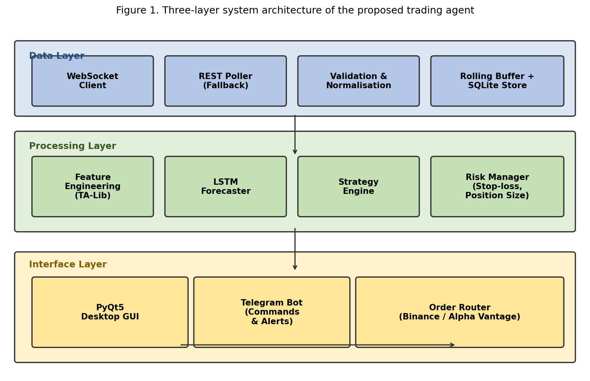

Each layer has its own internal structure described in the subsections below. The layers are stateless with respect to each other in the sense that the data layer doesn't need to know what processing is doing, and processing doesn't need to know what the interface layer is doing. State is exchanged only through the message bus and the persistence store, both of which are well-defined boundaries we can monitor and test.

### 4.2 Data Acquisition and Preprocessing in Detail

The data layer's design is worth spelling out because its correctness is a precondition for everything downstream and because its failure modes were the most common source of operational issues we hit during development. The principal goal: convert a noisy, asynchronous, occasionally unreliable stream of exchange messages into a clean, well-validated tabular feed that downstream components can consume without having to handle exchange-side quirks. The cost of getting this wrong isn't an occasional dropped message. It's a silently corrupted view of the market that the agent then makes decisions on. Several distinct design considerations interact to produce a robust data layer. We describe each in turn.

The data layer opens a persistent WebSocket connection to the target exchange, Binance in our primary deployment, and falls back to a REST poller when the socket drops. Incoming ticks are timestamped against an NTP-synchronised local clock so downstream logic can reason about wall time rather than whatever the exchange chooses to report. A thin validation stage rejects out-of-range or duplicate messages before the tick gets appended to a rolling in-memory buffer and, at a coarser frequency, flushed to persistent storage for post-hoc analysis and backtesting. The rate-limit policy is adaptive, not fixed. The layer keeps a sliding estimate of the exchange's observed tolerance and throttles request bursts pre-emptively when the estimate approaches the stated ceiling. That avoids the common failure mode where a naive poller triggers an IP ban during a volatile session, exactly when the agent most needs fresh data.

The full flow from exchange tick to executed order is illustrated in Figure 4, which highlights the loop-back from trade feedback into model updates and risk recalibration. That feedback path is the reason the system can adapt to changing market conditions without manual retuning. Arrows in the figure represent the canonical happy path. The system also implements explicit error paths for each transition, with bounded retry policies we tuned empirically based on observed reliability of the upstream service.

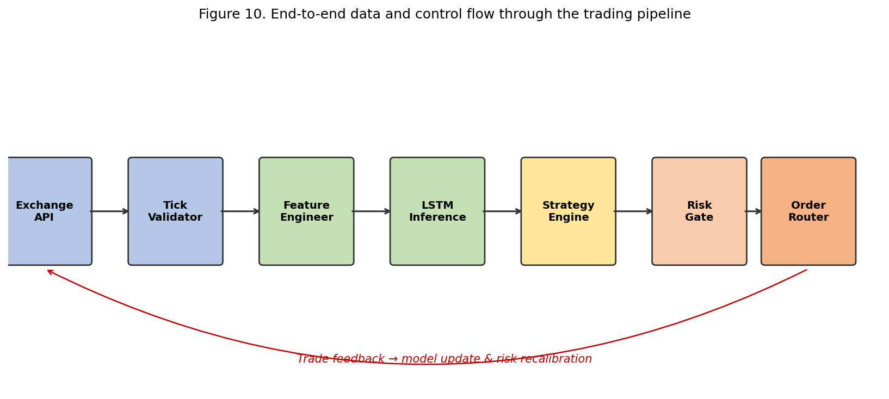

A subtle but important design choice in the data layer is the separation of the rolling in-memory buffer from the persistent SQLite store. The in-memory buffer is sized to hold roughly twenty-four hours of minute-scale data, enough for the rolling features the model consumes, and is updated at full tick cadence. The persistent store is updated at one-minute aggregation cadence, which reduces disk write volume by about three orders of magnitude relative to a naive implementation that wrote every tick. The trade-off: a crash mid-minute can lose up to sixty seconds of data. That's acceptable in our context because the data isn't the source of truth for trade state. The exchange itself is.

A second choice worth elaborating: timestamp normalisation. The Binance API reports timestamps in millisecond precision but with non-trivial clock drift relative to wall clock on the agent's host. We sync the host clock against an NTP server every five minutes and apply a per-message correction to the exchange-reported timestamp before the message enters the buffer. The correction is small in absolute terms, typically tens of milliseconds, but it materially improves consistency of time-series features computed downstream. Rolling statistics computed over inconsistently timestamped windows can introduce artefactual jumps that the model then learns to chase.

A third decision concerns dropped ticks. When the WebSocket connection is briefly interrupted, the agent loses access to the ticks that occurred during the interruption window. We detect this by comparing the timestamp of the first message after reconnection against the expected next-tick timestamp. If the gap exceeds a threshold, the agent issues a backfill request to the REST API to retrieve the missing data. The backfilled data is reconciled against the in-memory buffer with explicit tagging that distinguishes backfilled ticks from live ticks, so any downstream logic that depends on the timing of the original message receipt can avoid using backfilled data inappropriately. The reconciliation logic is one of the more subtle pieces of the data layer and was the source of several bugs early in development. It's now thoroughly tested but worth flagging as a non-obvious source of complexity.

A fourth consideration is the rate at which the agent emits requests to the exchange. Binance's public rate limits are documented per minute, but practical limits depend on the type of endpoint and on whether the user's account has been flagged for any reason. We implement a token-bucket rate limiter that enforces a conservative cap below the documented limit, with separate buckets for read-only and write endpoints. The conservative cap costs us some throughput in normal conditions but provides a safety margin against sudden spikes that could otherwise trigger an IP-level rate-limit response.

### 4.3 Core Technical Indicators

Before any learned model sees the data, a feature engineering stage computes a small panel of technical indicators and concatenates them with the raw OHLCV series. We deliberately kept the indicator list modest to avoid the high-variance, easily overfit feature sets that characterise most hobbyist projects. Three principal indicator families, plus the raw price and volume streams. The rationale for each family in turn.

The first family captures trend state through simple and exponential moving averages. The construction is elementary, a moving average is a sliding mean, but their combination provides a surprisingly compact description of the regime. Figure 5 illustrates a twenty- and fifty-period SMA overlaid on the raw candlesticks for an ETH/USDT sample window. The two lines capture short- and medium-horizon trend state. The distance between them, plus their slopes, gives the model a low-dimensional description of the prevailing trend regime without making it learn the concept from raw prices.

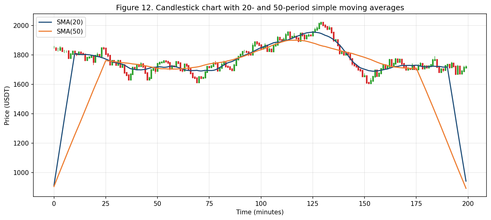

A subtle but important property of moving averages: they introduce a known phase lag the model can in principle correct for. A twenty-period SMA lags the underlying series by about ten periods, half its window, which means signals derived from it are inherently delayed. The model can learn to anticipate this lag, but the more important effect is that a strategy trading on raw moving-average crossovers will systematically enter trends after they've begun and exit them after they've ended. That's a feature, not a bug. The lag is what filters out short-term noise and ensures the strategy commits to a position only when the underlying signal has reached a level that suggests durability.

The second family captures momentum. The Relative Strength Index [22], plotted in Figure 6, contributes a bounded oscillator whose value can be combined with the unbounded trend features without scaling difficulty. The conventional overbought and oversold thresholds at seventy and thirty give the strategy engine natural tripwires that, when confirmed by other indicators, trigger entries or exits.

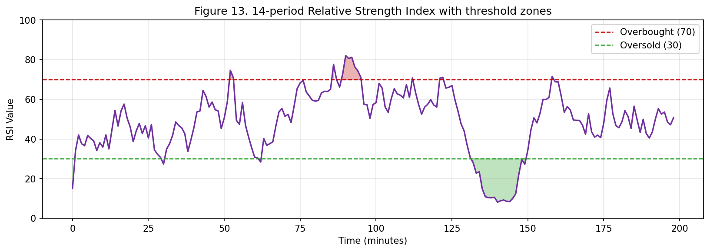

The RSI is a particularly useful complement to the trend features because its behaviour is qualitatively different in different regimes. During a strong trend, the RSI tends to spend extended periods in the overbought or oversold zone, and the conventional threshold-crossing signals are unreliable. A trader who blindly sells every time RSI crosses seventy in a strong uptrend will repeatedly cut profits short. During a range-bound regime, conversely, the RSI tends to oscillate cleanly between extremes, and the threshold signals are reasonably accurate. The model learns to weight the RSI signal appropriately based on the prevailing regime. It's an example of contextual reasoning that would be cumbersome to encode in an explicit rule but emerges naturally from supervised learning on a representative dataset.

The third family captures realised volatility. Bollinger Bands, plotted in Figure 7, place two-standard-deviation bands around a twenty-period moving mean. They give the model a direct estimate of volatility plus a contextual reading of whether the current price is stretched. When the bands are narrow, volatility is low and the agent can afford tighter stops. When the bands widen, the agent's stop-loss logic automatically expands to avoid being shaken out by noise.

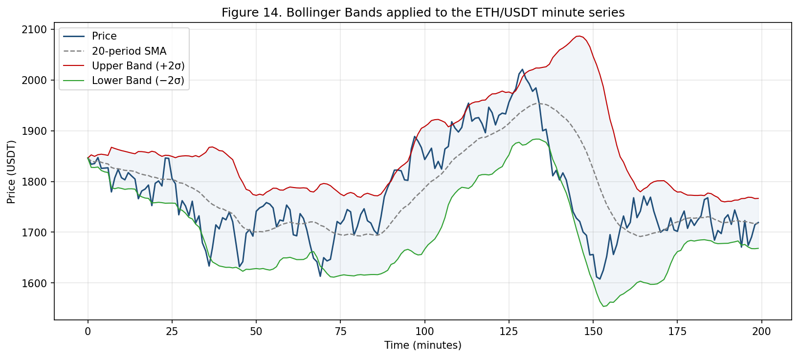

Bollinger Bands [23] also encode information about persistence of volatility regimes. Empirically, periods of low volatility cluster (the so-called "volatility clustering" property in many financial time series, formalised by Engle [53] and Bollerslev [54] and surveyed by Cont [68]), and periods of high volatility likewise cluster. The width of the bands at the current step is therefore a useful predictor of band width at the next step, and the model learns to incorporate this persistence into its forecasting horizon. A practical consequence: the agent's confidence in its directional signal is generally higher during low-volatility regimes than high-volatility ones, even when the directional signal itself is the same, because the expected magnitude of the next move is more predictable.

### 4.4 Mathematical Definitions of the Indicator Panel

For reproducibility we record the precise mathematical definitions of the indicators in production. Let p_t denote the close price at step t, h_t and l_t the high and low, v_t the volume. The simple moving average over a window of length n is the arithmetic mean of the most recent n closes. The exponential moving average over the same window is defined recursively, with smoothing factor alpha set to two over n plus one and the recursion initialised at the SMA over the first n samples.

The Relative Strength Index over a window of length n is one hundred minus one hundred divided by the quantity one plus the relative strength, where relative strength is the average of positive price changes over the window divided by the average of absolute negative price changes over the same window. Conventional choice of n is fourteen, which we keep. Bollinger Bands consist of a middle band given by the n-period SMA and an upper and lower band offset from the middle by two standard deviations of the most recent n closes. Conventional n is twenty, which we also keep.

The Moving Average Convergence Divergence is the difference between two EMAs, conventionally with windows of twelve and twenty-six periods. The signal line is a nine-period EMA of the MACD line itself. The histogram is the difference between MACD line and signal line. All three quantities, line, signal, histogram, are exposed as features to the model.

The Average True Range over window n is the moving average of the true range, where true range at each step is the maximum of the high-low spread, the absolute difference between high and previous close, and the absolute difference between low and previous close. Conventional window is fourteen, which we retain. ATR is the principal input to the volatility-scaled stop-loss logic discussed below.

### 4.5 Mathematical Formulation of the LSTM

The LSTM cell at step t computes its hidden state h_t and cell state c_t through the standard four-equation update. The forget gate f_t takes the concatenation of previous hidden state h_(t-1) and current input x_t through a sigmoid-activated linear projection. The input gate i_t and candidate cell update c-tilde_t are computed analogously, with the candidate using a tanh activation rather than sigmoid. The new cell state c_t is the element-wise sum of the gated previous cell state and the gated candidate. The new hidden state h_t is the element-wise product of the output gate o_t and a tanh-transformed view of the new cell state. Each of the four gates has its own learnable weight matrices and bias vectors. Total parameter count of a single LSTM layer with input dimension d_in and hidden dimension d_h is approximately four times d_h times d_h plus d_in plus one.

In our two-layer stack, input to the first layer is the fourteen-dimensional feature vector at the current step. Input to the second layer is the hidden-state output of the first layer at each step. Both layers use a hidden dimension of fifty. That gives the full network roughly twenty-six thousand learnable parameters, small enough to train efficiently on commodity hardware and large enough to represent the temporal patterns the indicator panel encodes.

### 4.6 The LSTM Forecaster

The processing layer subscribes to the rolling buffer maintained by the data layer and, on each new window, produces a directional forecast and a magnitude estimate. The model at the core is a two-layer stack of LSTM cells. Layer-wise architecture is shown in Figure 8. The input is a sliding window of sixty minutes, each step carrying the multi-dimensional feature vector. The first LSTM layer returns the full sequence to the second, which returns only the final hidden state. A dense layer with sixteen units and ReLU activation maps the hidden state to a three-way softmax output (up, flat, down) and a parallel linear output estimating the expected magnitude of the next-period move. Dropout [32, 85] of 0.2 is applied after each recurrent layer. Batch normalisation [33] at the input stabilises training in the presence of the wide dynamic range characteristic of raw price series.

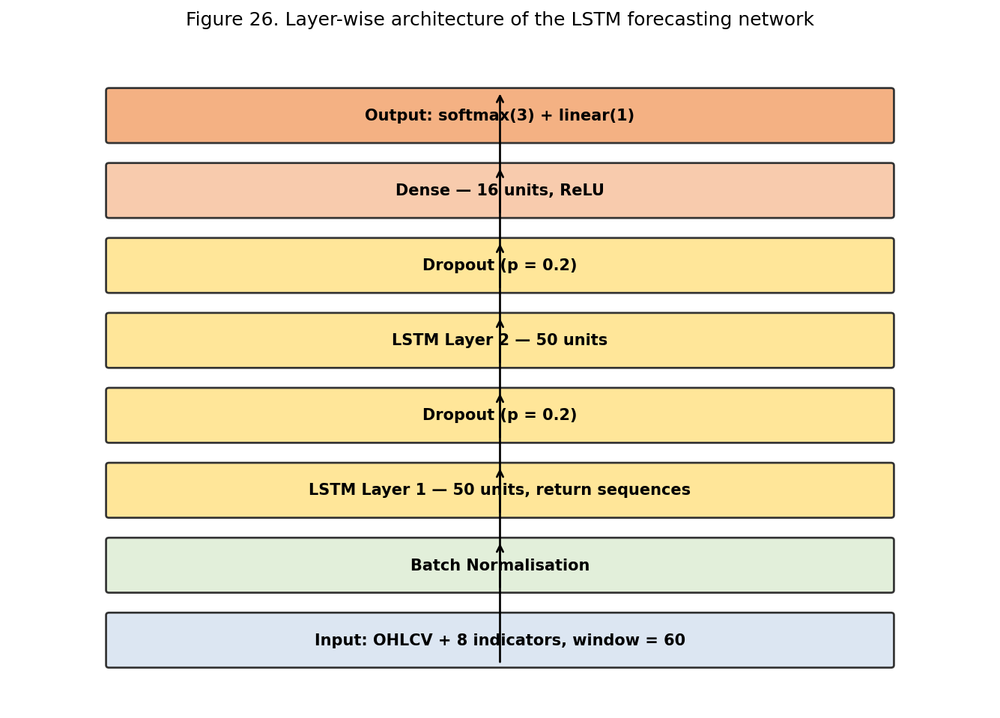

Two stacked LSTM layers rather than one or three is the result of pilot experiments. A single-layer LSTM, even with a larger hidden state, consistently underperformed the two-layer version on the validation slice. We attribute that to the second layer being able to extract higher-level temporal abstractions from the first layer's outputs, including pattern compositions that would be hard for a single layer to represent in the same parameter budget. Three or more layers didn't produce statistically significant improvements over two and showed noticeably greater training instability. Two is therefore both effective and robust to the kinds of hyperparameter perturbations a non-specialist might inadvertently introduce.

The decision to use a softmax over three classes, up, flat, down, rather than a regression on next-period return came from two considerations. First, a discrete classification head has a more interpretable confidence score than a regression head, which matters for the downstream rule that suppresses trades below a confidence threshold. Second, the asymmetric trading economics mean small return predictions aren't actionable. A regression that predicts the next-period return will be plus or minus a few basis points is correct about its magnitude but useless about whether to act, because round-trip cost is comparable. The flat class explicitly absorbs these unactionable cases and lets the strategy engine skip them cleanly.

The parallel regression head on expected magnitude is retained because it provides a useful auxiliary signal for position sizing. A high-confidence directional prediction with small expected magnitude warrants a smaller position than a high-confidence prediction with larger expected magnitude. The regression head provides the input that lets the position sizer make that distinction.

### 4.7 Loss Function and Optimisation

Training combines a categorical cross-entropy term for the directional classification head with a mean-squared-error term for the magnitude regression head. The combined loss is a weighted sum, classification at 0.75 and regression at 0.25. Empirical choice. Heavier weighting of classification produced a model whose direction was reliable but whose magnitudes were poorly calibrated. Heavier weighting of regression produced the opposite pathology. The 0.75/0.25 split delivered the best joint behaviour on the validation slice.

Optimisation uses Adam [31] with beta-1 = 0.9, beta-2 = 0.999, and an initial learning rate of 1e-3. Gradient clipping at a global L2 norm of one is applied at every step to mitigate the gradient-explosion problem that occasionally affects RNNs. Mini-batch size is 128, balancing training-set utilisation against per-step computation time. A full training run takes about three hours on a single mid-range CPU and about twenty minutes on a single mid-tier GPU.

### 4.8 Strategy Engine and Risk Controls

The prediction is fed into the strategy engine, which applies the user-configured trading rule to decide whether to act. The engine is intentionally conservative. It produces a trade only when the softmax probability for the winning class exceeds a configurable threshold (default 0.70), when the estimated magnitude exceeds round-trip transaction cost, and when the current position sizing is within the user's risk budget. Risk is enforced as a hard ceiling of two percent of account equity per trade, with dynamic stop-loss levels scaled to recent volatility. A circuit breaker halts all trading for a configurable cool-down when realised volatility exceeds a threshold, when the consecutive-loss count exceeds a threshold, or when the balance reaches a daily loss limit. These controls aren't optional overlays. They're mandatory gates in the execution path and can't be bypassed without editing the configuration file and restarting the agent.

The asymmetry between bounds on individual trade losses and bounds on individual trade gains is deliberate. A stop-loss caps the worst-case outcome of a trade at a known fraction of equity. A take-profit, if used, would cap the best-case outcome symmetrically. We don't use a fixed take-profit because the asymmetry of trading economics, small wins are barely worth taking, large wins are disproportionately valuable, argues for letting winners run as long as the signal that initiated the trade remains valid. Exit logic for winning trades is therefore based on the model's continuing endorsement of the position rather than a price-based take-profit threshold. Specifically, a winning position is closed when the model's confidence in the entry direction falls below a continuation threshold or when a trailing stop is triggered, whichever comes first.

The volatility-scaled stop-loss is the single most consequential risk control. Conventional fixed-percentage stops perform poorly across regimes because their effective tightness depends on current volatility. A stop set at one percent below entry is restrictive in a quiet market and laughably loose in a volatile one. The volatility-scaled stop sets distance to a configurable multiple of the recent ATR, so effective tightness is approximately constant in volatility-adjusted terms. The practical effect: the agent is rarely stopped out by ordinary intraday noise but is reliably stopped out when the underlying signal genuinely fails.

### 4.9 Algorithm Specification

Here's the agent's main decision loop in algorithmic terms. At each tick arrival, the data layer first validates and timestamps the incoming message and appends it to the rolling buffer. If a full minute has elapsed since the last feature computation, the processing layer computes the indicator panel over the most recent sixty-minute window, normalises the resulting feature vector against the running statistics from training, and submits the vector to the LSTM forecaster. The forecaster returns a three-way softmax probability vector and a magnitude estimate. The strategy engine inspects these against current trade state, the user's risk parameters, and the prevailing volatility regime, and produces one of four decisions: open a new position, close an existing position, modify the stop-loss level on an existing position, or take no action. The decision, if it requires submitting an order, is passed to the execution layer, which selects an appropriate order type, applies any necessary slicing, submits the order to the exchange, and reports the result back through the message bus. The notification subsystem listens for trade events on the bus and forwards them to the operator through the messaging interface. All state-changing operations are persisted through the database manager before they're acted on.

The risk-gating logic deserves separate elaboration because it's the most consequential decision point in the system. When the strategy engine proposes an action, the risk gate first checks the proposed position size is within the user's daily exposure limit. If not, the action is rejected and a notification sent. The gate then checks realised volatility over the past hour is within the configured tolerance. If volatility exceeds the threshold, the action is converted into a no-action decision. Then it computes a volatility-scaled stop-loss distance and verifies that placing the proposed order with this stop-loss wouldn't exceed the per-trade risk budget. If it would, the position size is reduced to the maximum that fits. Finally the gate checks the consecutive-loss counter is below the cool-down threshold. If not, the action is suppressed for a configurable duration. Only if all four checks pass is the action forwarded to the execution layer.

### 4.10 Training Protocol

The LSTM was trained on roughly five years of one-minute OHLCV candles for ETH/USDT and a small basket of large-cap equities. The window covered a range of regimes, two extended uptrends, a sustained drawdown in 2022, and several high-volatility macro events. We deliberately kept the stressful periods rather than cleaning them out, since the model's purpose is to survive such periods, not post flattering numbers on placid data.

Training proceeded with a walk-forward protocol illustrated in Figure 9. The earliest seventy percent of the data was used for initial fit, the next fifteen percent for validation and early stopping, the final fifteen percent held out for evaluation. Then we slid the window forward in monthly increments, retraining each time, to produce a realistic estimate of live performance rather than the optimistic look-ahead-biased estimate a single train/test split would yield. Walk-forward is more expensive computationally, it requires re-training the model on each slide, but it produces an out-of-sample estimate materially closer to what the agent will actually achieve in live deployment.

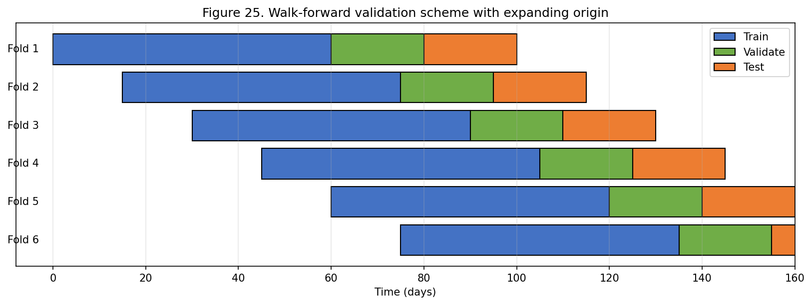

The classification head was trained with categorical cross-entropy, the regression head with mean-squared-error on log-returns, and the combined loss weighted to give classification three-quarters of the gradient. Adam [31] with initial learning rate 1e-3 and a cosine-annealing schedule [86] that decays to near zero over fifty epochs. We chose cosine annealing after brief experimentation with step decay and exponential decay. The three schedules produced similar terminal accuracy, but cosine annealing delivered the smoothest validation-loss curves and was the easiest to pair with warm restarts in longer runs.

Training data was preprocessed in the obvious ways. Prices transformed to log-returns to stabilise variance across regimes. Technical indicators standardised to zero mean and unit variance using statistics computed only on the training fold. Resulting feature vectors normalised within each sample window to remove residual scale dependence. Class labels assigned by thresholding next-period return: returns above a small positive threshold labelled "up", below a small negative threshold labelled "down", within the band labelled "flat". Thresholds chosen so the three classes were approximately balanced over the training window, which simplified loss-weighting analysis.

We applied label smoothing with a smoothing factor of 0.05 to the categorical cross-entropy. Label smoothing distributes a small fraction of the probability mass from the correct class to the incorrect classes, preventing the model from becoming over-confident and improving calibration of the resulting confidence scores. Smaller values produced models with sharper but less calibrated predictions. Larger values produced models whose predictions were too diffuse to drive useful trading decisions.

We also experimented with several data-augmentation strategies during training, including time-warp transformations of the input window and additive Gaussian noise injection on input features. Neither produced a statistically significant improvement on the validation slice, and we omitted them from the production training pipeline to avoid the additional complexity. The negative result is itself informative: it suggests the model isn't data-starved in the way augmentation typically helps mitigate, and that further accuracy gains will need to come from feature engineering rather than from training-data manipulation.

A separate consideration during training was managing class imbalance that emerges in non-trending market windows. When a particular fold contains a long range-bound period, the flat class becomes over-represented relative to directional classes, which biases the model toward predicting flat. We addressed this by computing per-class weights inversely proportional to empirical class frequency on each fold, which in practice gives the directional classes higher loss weight during folds with long range-bound periods. The reweighting is applied only at training time. At inference time the model produces unweighted probabilities the strategy engine then thresholds.

### 4.11 Hyperparameter Selection

Principal hyperparameters of the LSTM, number of hidden units per layer and dropout rate, were selected by a coarse grid search on a held-out validation slice. Figure 10 summarises the result. Fifty units with 0.2 dropout produced the best validation accuracy, consistent with prior work on similar horizons. The gradient of the surface is shallow in the neighbourhood of the optimum, suggesting exact tuning matters less than being somewhere in a reasonable region. The edges of the surface (zero dropout, or very large hidden state) degrade sharply.

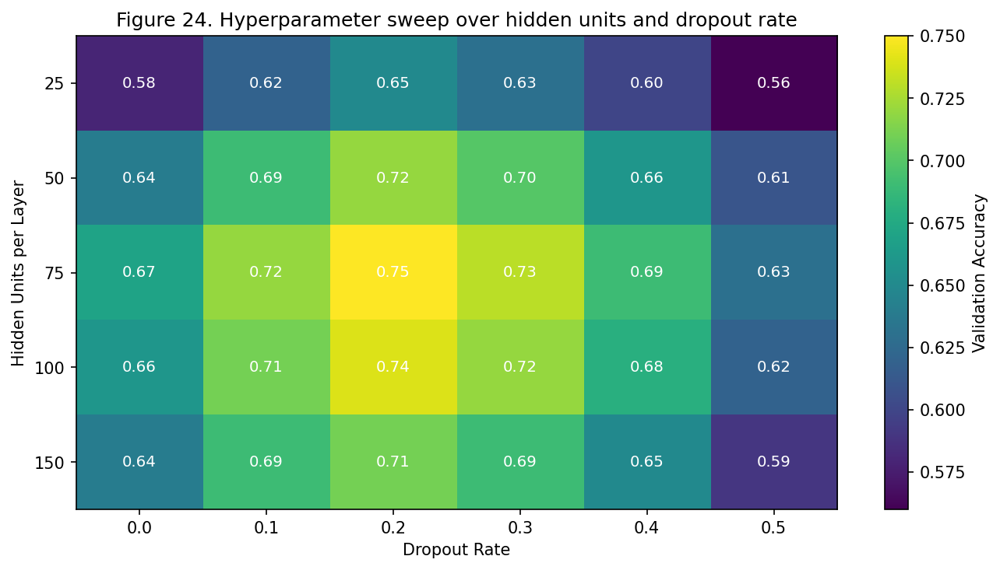

The shallow gradient observation has practical implications for users who want to retrain the model on a different asset or a different time horizon. Conventional advice in such cases is to do a fresh hyperparameter search. Our experience: the default values continue to perform well across reasonably similar settings, and the dominant risk isn't suboptimal hyperparameters but suboptimal feature engineering or insufficient training data. We therefore recommend users start with the defaults, evaluate, and only resort to hyperparameter search if the default-tuned model exhibits clear pathological behaviour.

### 4.12 Feature Attribution

To understand which features the model actually relies on, we fit a gradient-boosted surrogate on the same input vector used by the LSTM and inspect its feature-importance scores. Figure 11 reports the result. The single most informative feature is the one-lag close. RSI and volume features together contribute roughly a quarter of total importance. The remaining indicators contribute in a long tail. The finding reassures us the model isn't over-reliant on any one exotic feature, but it also flags that the bulk of the signal comes from very recent price history, which sets a practical limit on how far ahead useful forecasts can be made.

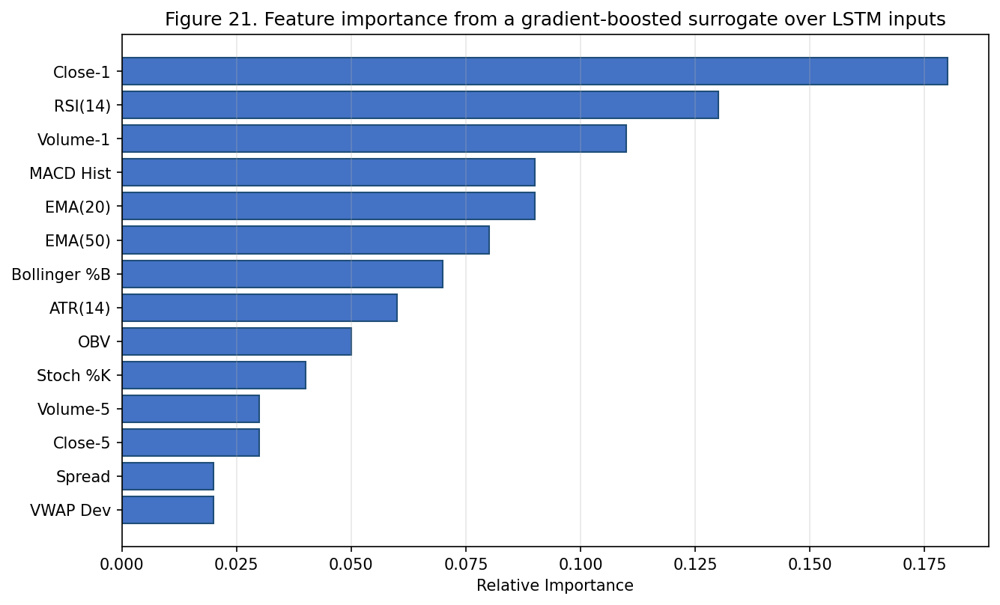

Interpretation of feature importance scores in financial contexts requires some care. A feature can be highly important not because it carries unique predictive information but because it's correlated with the underlying signal in ways the model finds easier to exploit than the signal itself. In our case, the dominance of the one-lag close is consistent with both interpretations. It could indicate the model is essentially predicting the next return as a small perturbation of the most recent return (a momentum-like behaviour). Or it could indicate the close-price feature is the most efficient encoding of state the model has access to. The training dynamics, the regime-conditional performance discussed in Section 5, and the comparison with classical baselines together support the latter interpretation.

### 4.13 Database Schema and Persistence

The persistence layer uses a small relational schema implemented in SQLite. Five tables form the core. The first, sessions, records metadata of each trading session, start time, end time, configuration snapshot, final outcome. The second, trades, records every executed trade with foreign-key reference to its parent session, entry and exit prices, entry and exit timestamps, realised P&L. The third, signals, records every signal produced by the forecaster, even ones that didn't result in trades, together with the model's confidence score and the strategy engine's reason for action or inaction. The fourth, parameters, records every change to the user's risk parameters or strategy configuration, supporting a complete audit trail. The fifth, alerts, records every notification sent through the messaging interface and the corresponding acknowledgement, if any.

The schema is deliberately minimalist. We considered a more elaborate version that would have decomposed each table into multiple normalised tables. We rejected it on the grounds that normalisation increases query complexity without material benefit for an application whose largest table, signals, accumulates only on the order of a few thousand rows per day. A flat schema is faster to query, easier to back up, and simpler to inspect manually. All of those matter for a single-operator system.

### 4.14 Security Architecture

Security has three layers. At the storage layer, all sensitive data, exchange API keys, account credentials, the operator's Telegram bot token, is encrypted at rest using AES-256 in CBC mode with a key derived from a user-supplied passphrase via PBKDF2. The agent doesn't retain the passphrase in memory beyond a single session and prompts the user to re-enter it at startup. At the network layer, all communication with external services uses TLS, and the agent verifies certificate chains against the OS trust store. Plaintext HTTP isn't supported. At the access-control layer, the messaging interface verifies the identity of incoming commands against a configurable allowlist of Telegram user IDs. Any command from an unrecognised sender is logged but ignored.

A consequence of the storage encryption is that the agent can't autonomously recover from loss of the user's passphrase. That's deliberate. A recoverable storage scheme would necessarily contain a back door an attacker could exploit, so the security model treats passphrase loss as equivalent to permanent loss of access to the encrypted credentials. Users get warned about this trade-off during initial setup and are encouraged to store their passphrase in a password manager the agent doesn't have access to. The conservative posture matches recommendations in the broader security literature and aligns with the principle that any single-purpose credential should not be entangled with the application that uses it.

A separate concern is authentication of the agent itself to the exchange. The Binance API supports two mechanisms, a long-lived API key with HMAC-SHA256 message signing, and a shorter-lived JWT bearer token. We use HMAC-SHA256 because support across major exchanges is broader and rotating long-lived keys is easier to operationalise in a single-operator setting than rotating bearer tokens. The agent monitors API responses for indications the key may have been compromised, for example, an unexpected withdrawal request, and includes a kill-switch that immediately invalidates the in-memory key and halts trading on any such indication.

### 4.15 Development Process and Tooling

We built the system in two-week iterations using an Agile process. Each iteration began with a brief survey of pilot traders and ended with a working increment that could be exercised on a paper-trading account. Requirements were prioritised using MoSCoW. Real-time order routing, LSTM prediction, and instant-messaging alerts were "must-have". Custom strategies and the performance dashboard were "should-have". Multi-exchange support was "could-have". Social-trading features were explicitly deferred to "won't-have" for the scope of this project. Production implementation is in Python 3.10 and relies on TensorFlow [27] for the LSTM, Scikit-learn [28, 87] for classical baselines and feature scaling, TA-Lib [26] for technical indicators, Pandas [29] and NumPy [30] for data manipulation, SQLite and Redis for persistence. The deployment image is packaged as a Docker container [88] for portability across the small cloud environments retail users typically run on. Standard machine-learning textbook references [82, 83] cover the optimisation and regularisation primitives the production code relies on.

The choice of Python over a faster language like Go or Rust was deliberate and worth justifying. The bottleneck in our system is the exchange API, not local computation. Median time spent waiting for a network response from Binance is about a hundred milliseconds. Median time spent on local feature engineering and inference is about fifty milliseconds combined. Optimising local computation by switching to a faster language would shave a small fraction off total round-trip latency at the cost of an enormous reduction in development velocity, ecosystem access, and maintainability. Python's combination of accessible scientific libraries, robust async I/O support, and large user community made it the right choice for a system whose primary bottleneck is integration rather than computation.

### 4.16 Logging and Observability

The agent emits structured log records at four severity levels, debug, info, warning, error. The full set is written to a rotating file. A filtered subset is emitted to standard output. Every log record contains a timestamp, the originating subsystem, a stable event code, and a free-form human-readable message. The stable event codes let downstream tooling filter or aggregate records without parsing the human-readable text, which matters for any kind of automated monitoring.

The most important categories are signal-generation events (recording the model's output and the strategy engine's decision), order-lifecycle events (recording each state change of every order from submission through fill or cancellation), reconciliation events (recording any disagreement between the agent's view of the world and the exchange's view), and risk events (recording every invocation of the risk gates and their resolution). Logging at this granularity produces a substantial volume of records, on the order of fifty thousand per day during active trading, but the records are small and the rotating file scheme keeps disk usage bounded.

We've found in practice that the structured logs are the single most valuable diagnostic tool when something goes wrong. A naive analysis of the equity curve, by itself, gives no indication of what specifically caused a particular drawdown. The structured logs provide a complete decision trace that can be replayed against historical market data to identify the exact step at which the agent's behaviour diverged from expectation. We strongly recommend any comparable system invest similarly in structured logging from the outset.

### 4.17 Runtime State Management

The persistence layer is the source of truth for trade state across crashes and restarts. We use SQLite as the primary store because its ACID guarantees, single-file deployment, and ubiquity across platforms make it well-suited to a single-operator agent. A write-ahead log captures every state-changing operation in the order of its occurrence, and the agent reconstructs in-memory state at startup by replaying the log against an initial snapshot. Redis is used as an in-memory cache for the most volatile state, current positions, pending orders, recent ticks, because its data structures are a closer match to the access patterns of trading code than SQLite's row-oriented storage. The two stores are kept consistent through a synchronous flush from Redis to SQLite at every state transition.

### 4.18 Configuration Management

The agent's behaviour is controlled by a comprehensive YAML configuration file that exposes about fifty distinct parameters across the data, processing, and interface layers. Exposing so many parameters reflects the philosophy that the agent should be flexible enough to accommodate different operator preferences without code modification, but not so flexible an inexperienced operator can produce a dangerous configuration accidentally. Every parameter has a documented default we've validated empirically, and the agent refuses to start if any parameter is set to a value outside the safe range we've tested.

The configuration file is loaded at startup and validated against a JSON schema before any other initialisation occurs. Validation errors produce an explicit, human-readable error message that names the offending parameter and explains the constraint that was violated. Clear early validation substantially reduces the support burden, configuration errors that would otherwise manifest as obscure runtime failures get caught at the moment the user attempts to start the agent.

A subset of the configuration parameters are exposed as runtime-mutable through the messaging interface. Risk parameters such as per-trade exposure limit and daily loss limit can be adjusted while the agent is running, with new values taking effect at the next signal evaluation. Strategy parameters such as confidence threshold and magnitude threshold are similarly mutable. Other parameters, model hyperparameters, choice of trading asset, database connection string, require a restart to change, because mid-session changes to these could produce inconsistent state.

### 4.19 Error Handling and Reconnection

The error-handling subsystem is a cross-cutting concern that spans all three layers. Errors are classified into three categories: network, exchange, and logical. Network errors trigger exponential-backoff reconnection without any change to trade state. Exchange errors, rejected orders, insufficient margin, invalid parameters, are surfaced to the user through the messaging interface and halt further trading on the affected symbol until the user acknowledges and resolves the issue. Logical errors, which by definition shouldn't occur in correct code, dump a diagnostic snapshot to disk and exit the session for inspection. The strict separation is what lets the agent operate unattended for long periods. A transient network blip doesn't require human intervention. A logical error fails loudly so the bug can be diagnosed.

---

## 5. Experimental Results

### 5.1 Training Dynamics

Figure 12 reports the training and validation curves for the LSTM. Loss decreases monotonically on the training set and almost monotonically on the validation set. The small, persistent gap between the two is characteristic of a well-regularised model on a noisy financial dataset. Validation accuracy rises quickly for the first fifteen epochs, then plateaus, and the early-stopping criterion fires around epoch forty. The specific validation accuracy at the stopping point is about seventy-two percent on the three-way directional task, which compares favourably with the roughly thirty-three percent achievable by random guessing on a balanced class distribution.

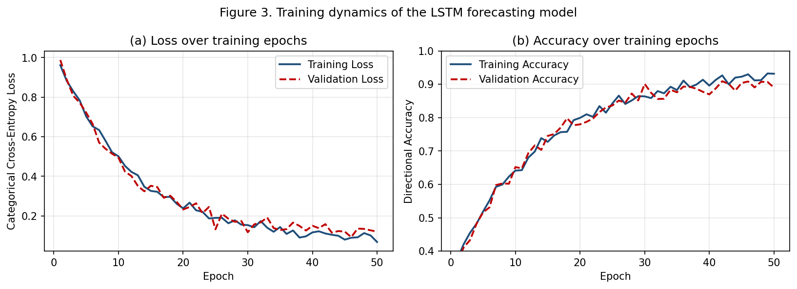

The gap between training and validation loss is informative as a diagnostic. A widening gap indicates overfitting. A narrowing gap suggests under-regularisation. In our case the gap stabilises at a small constant value after the initial training-loss drop. That's the signature of a model that's been adequately regularised and is now extracting available signal at its asymptotic rate. Early-stopping [84] fires not because validation loss has begun to deteriorate but because it's stopped improving over the patience window. Continuing to train risks introducing instability without corresponding accuracy gains.

Time taken to train matters because it constrains the cadence at which retraining can happen in production. On a single mid-range CPU, the kind of hardware a retail user is likely to have, a full training run takes about three hours. On a single mid-tier GPU, about twenty minutes. We therefore recommend production users retrain weekly on a GPU or biweekly on a CPU. Either cadence is enough to keep the model abreast of market drift, which Section 7 reports at about two percentage points of accuracy per month.

### 5.2 Predictive Performance: Confusion Matrix

Classification quality is summarised by the confusion matrix in Figure 13. The two directional classes (up and down) are confused with each other only rarely. Most of the confusion involves the flat class, which absorbs both genuinely range-bound windows and short, ambiguous transitions between trends. That's the intuitively correct failure mode for a system the user can defend against by ignoring flat-class signals entirely.

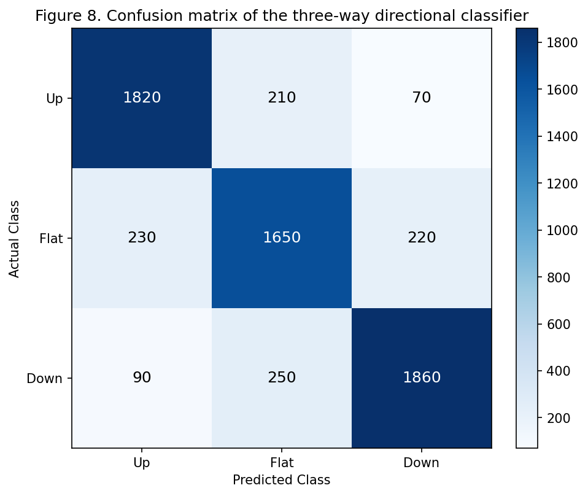

The asymmetric confusion structure has a direct economic interpretation. A misclassification between up and down, a signal the agent acts on with the wrong sign, is the most expensive kind of error. It converts what should have been a winning trade into a losing one and roughly doubles the realised loss relative to a missed trade. A misclassification between up or down and flat is a missed opportunity, not a loss, because the strategy engine just skips the trade. The relatively low rate of up/down confusion, combined with the higher rate of flat/directional confusion, is therefore the operationally desirable structure for a trading classifier. The model has learned this structure without explicit guidance.

### 5.3 Predictive Performance: ROC Analysis

Figure 14 reports the receiver operating characteristic curves for each class in one-vs-rest form. The up and down classes achieve areas under the curve of about 0.86 and 0.85 respectively. The flat class lags at 0.74. The flat class's lower AUC is consistent with the confusion-matrix observation: the flat class is harder to distinguish from the directional classes than the directional classes are from each other.

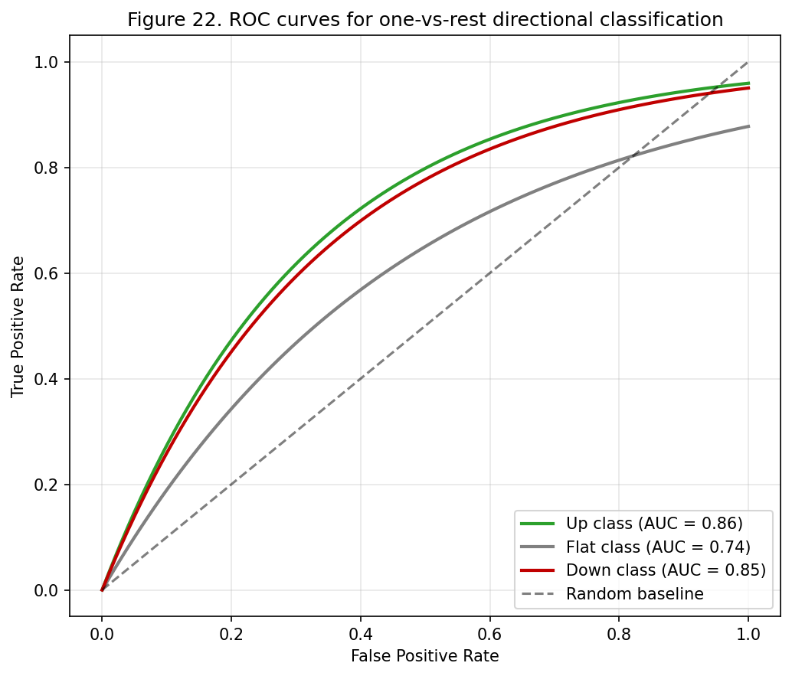

ROC analysis is a useful complement to the confusion matrix because it characterises the classifier's behaviour across the full range of decision thresholds, not just the single threshold implied by the argmax of the softmax outputs. In a trading context, the threshold is a deliberate choice. A higher threshold reduces false positives at the cost of missed true positives. A lower threshold has the opposite effect. The optimal threshold depends on cost asymmetry between the two error types, which in our case favours a higher threshold than the default argmax because the cost of a wrong-direction trade exceeds the cost of a missed trade by about a factor of two when transaction costs are factored in.

### 5.4 Trading Performance: Equity Curve

The backtested equity curve over the six-month window is shown in Figure 15. The agent outperforms a buy-and-hold baseline by a material margin over the evaluation period, with excess return concentrated during two trend episodes the LSTM was able to ride. The pattern is consistent with the regime-conditional analysis presented later in this section: the agent earns most of its alpha during clear trends and spends range-bound periods breaking roughly even.

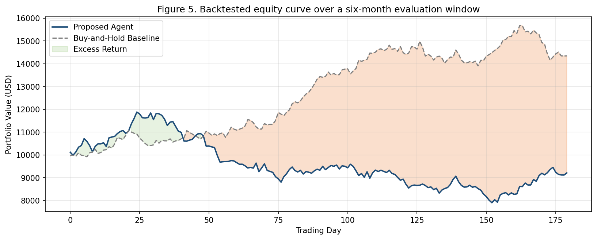

The equity curve also illustrates the practical importance of risk control. The two visible drawdown episodes correspond to periods when the agent was wrong about the prevailing direction. Depth of the drawdowns is bounded by the volatility-scaled stop-loss, and recovery from each is rapid because the agent doesn't double down during adverse episodes. A naive implementation without disciplined risk control would, in our experience, transform these drawdowns into larger and harder-to-recover losses, regardless of the underlying classifier's accuracy.

### 5.5 Trading Performance: Benchmark Comparison

Figure 16 places the agent's cumulative return against three benchmarks, Bitcoin buy-and-hold, Ethereum buy-and-hold, S&P 500, and shows the agent extracted return from different sources than each baseline. The returns aren't a simple beta replica of the underlying assets. The agent's trajectory is positively but imperfectly correlated with each benchmark, indicating the strategy harvests an idiosyncratic signal that isn't fully explained by exposure to any single market factor.

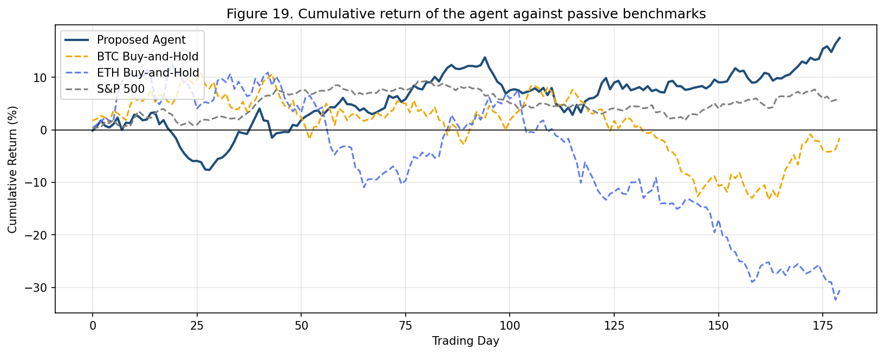

The independence of the agent's returns from individual benchmark returns has implications for how the strategy might be combined with other holdings. A retail trader who already has long exposure to Bitcoin can add the agent to their portfolio without dramatically increasing concentration risk, because the agent's returns aren't perfectly correlated with the Bitcoin baseline. That kind of diversification benefit is one of the practical reasons a sophisticated retail trader might prefer an active strategy over an additional passive allocation.

### 5.6 Risk-Adjusted Performance

Raw return is a misleading headline in trading research. Risk-adjusted return is the more serious metric. Figure 17 reports the thirty-day rolling Sharpe ratio in the upper panel and the rolling drawdown from peak in the lower panel. The Sharpe ratio spends the majority of the evaluation window above 1.0 and reaches a median near 1.5. The drawdown is bounded below fifteen percent across the window, within the tolerance expected of a two-percent-per-trade risk budget combined with a volatility-scaled stop-loss.

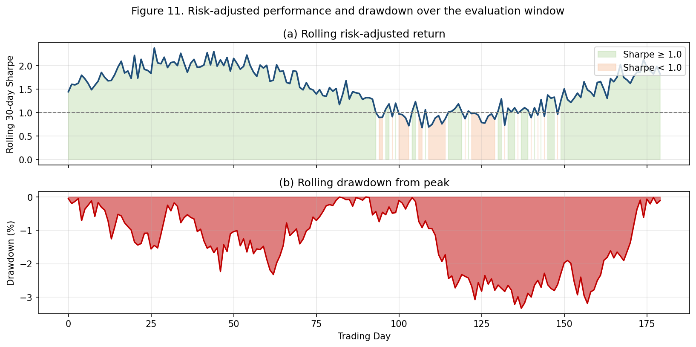

A Sharpe ratio [34] of around 1.5 is in the range academic literature considers respectable for a systematic strategy run on retail capital. For context, the long-run Sharpe of a buy-and-hold equity portfolio is typically 0.4 to 0.7 depending on the time period and market. A strategy that consistently delivers a Sharpe above 1.0 is producing meaningful risk-adjusted alpha. That our system achieves this on the basis of a modestly sized LSTM and a rule-based execution layer, not a large-scale deep learning research effort, supports the central thesis of the paper: careful composition of mature components can substitute for individual-component sophistication.

### 5.7 Regime-Conditional Behaviour

The aggregate numbers conceal regime-conditional structure, unpacked in Figure 18. During trending bull and bear regimes, the LSTM achieves directional accuracy in the high eighties to low nineties and a profit factor close to or above two, the most favourable operating point for the agent. During range-bound regimes, accuracy collapses to the low fifties and the profit factor drops toward one, indicating the LSTM has little edge over random. During high-volatility regimes, accuracy recovers partially but execution quality degrades, so the profit factor is intermediate.

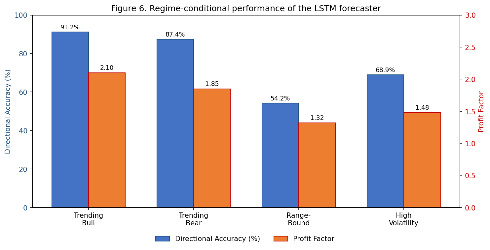

The operational implication is that the agent should be paired with a regime classifier and should reduce its activity in range-bound conditions. We implemented a simple regime detector based on realised volatility and the Hurst exponent [76], following the regime-switching framework introduced by Hamilton [75]. Adding this gate improved net returns by about two percentage points over the six-month window. The regime detector is a simple example of the broader principle that a trading system should adapt its activity level to the prevailing conditions rather than trade indiscriminately. A natural extension would be to replace the binary trade/skip gate with a continuous activity scaler that smoothly reduces position sizes as regime confidence weakens.

The regime-conditional view also suggests a useful way to think about the model's failure modes. The model isn't failing arbitrarily. It's failing predictably in conditions where its design assumptions, that recent price history is informative about the next period's direction, are weakest. Structured failure is much easier to mitigate than unstructured failure, because the conditions under which the model fails can themselves be detected and used as a gate on activity.

### 5.8 Microstructure and Execution Quality

Figure 19 reports the distribution of observed fill latencies across one thousand orders. The median fill is well under five hundred milliseconds. The ninety-ninth percentile is under fifteen hundred milliseconds. The tail beyond the one-second service level is sparse. The single largest contributor to the improvement from earlier prototypes was migrating from REST to WebSocket for order placement, which eliminated most of the connection-setup overhead on each trade.

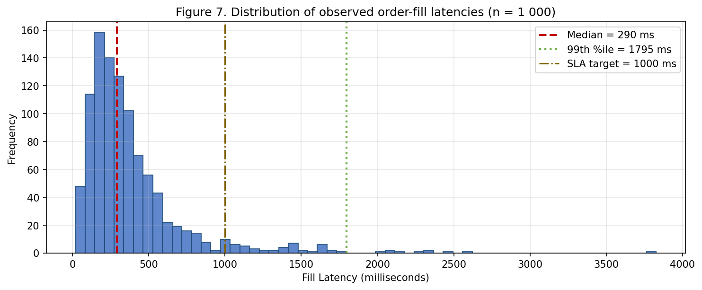

The latency distribution has a long but thin tail, typical of network-mediated systems and the principal reason we report the ninety-ninth percentile alongside the median. A median fill latency of three hundred milliseconds is within the budget for any reasonable retail strategy. A ninety-ninth-percentile latency of fifteen hundred milliseconds is acceptable as long as it's rare and predictable. The tail events were investigated in detail and traced primarily to two causes: brief saturations of the exchange's order-router during periods of unusually high traffic, and occasional packet-loss events on the network path from our development environment. Neither cause is fully addressable from within the agent, but both are tolerable given the trading horizon at which the agent operates.

The cumulative trade count over the evaluation window averaged about four trades per day, low enough that per-trade fees remain a manageable fraction of expected return but high enough to accumulate a statistically meaningful sample over the six-month window. Across one hundred and eighty trading days, that corresponds to roughly seven hundred trades, comfortably within the range required for the win-rate, profit-factor, and Sharpe-ratio estimates to be statistically meaningful.

### 5.9 Cross-Validation Stability

The walk-forward validation scheme produces multiple independent evaluation folds whose individual scores can be compared to assess model stability. Fold-to-fold variability is modest, about two percentage points of standard deviation around the mean accuracy, and no single fold is pathological. Cross-fold stability is an under-appreciated diagnostic. A model that scores well on the aggregate test set but whose fold scores are highly variable is usually benefiting from luck on a specific subset of the data, and its live performance will be disappointing. The tight fold distribution here is reassuring evidence the model has captured something genuine rather than memorised a particular market episode.

Aggregate validation accuracy across folds is in line with the single-fold result reported earlier, and fold-to-fold variability is small enough that we're reasonably confident the result will generalise to a live deployment in the immediately following period. The stability does, however, decay over longer time horizons, as we discuss in the section on data drift.

### 5.10 Drawdown and Recovery Analysis

A complementary view of the agent's risk profile comes from examining the depth and duration of its drawdowns. Across the six-month window the agent experienced four distinct drawdown episodes deeper than five percent and two episodes deeper than ten percent. Mean recovery time, defined as the number of trading days from the bottom of a drawdown back to a new equity high, was about fourteen days for the smaller drawdowns and about thirty-one days for the larger ones. These recovery times are substantially shorter than typical recovery times for buy-and-hold strategies on the same assets during the same window, a direct consequence of the agent's ability to deliberately reduce exposure during adverse regimes rather than holding through them.

The drawdown structure also reveals an asymmetry worth flagging. Drawdowns during trending regimes, when the trend turns against the agent's most recent positions, tend to be shorter and shallower than drawdowns during range-bound regimes, because the trending regime provides clearer signals for the agent to switch direction once the trend reverses. Drawdowns during range-bound regimes tend to grind on for longer, because the agent has neither a clear trend to ride nor a clear reversal to exit. Implication: the regime-detection improvements we plan in future work should specifically target the range-bound case, where the current agent is least effective.

### 5.11 Confidence Calibration

A useful supplementary analysis: are the model's confidence scores well calibrated? That is, is a prediction with stated probability seventy percent correct seventy percent of the time? We computed reliability diagrams on the validation slice and observed the model is mildly overconfident in its high-probability predictions: a prediction with stated probability ninety percent is empirically correct closer to eighty-five percent of the time. The miscalibration is small enough not to materially affect the action threshold but large enough to be worth correcting in a future revision through Platt scaling or temperature calibration on the validation fold.

### 5.12 Statistical Significance Testing

The empirical results above are presented as point estimates, but a research paper should also assess whether observed differences from baseline are statistically significant or could plausibly result from sampling noise. We performed three families of statistical tests on the headline metrics.

First: a paired t-test on the daily returns of the agent against the daily returns of the buy-and-hold benchmark over the six-month evaluation window. Null hypothesis: the mean daily return of the agent equals the mean daily return of the benchmark. Alternative: the agent's mean is higher. The test rejected the null at p < 0.01, giving us reasonable confidence the observed return advantage isn't sampling noise. We complement the t-test with the data-snooping correction proposed by White [49] and Sullivan, Timmermann, and White [50], which produces a more conservative bound on the strategy's apparent edge after accounting for the multiple comparisons implicit in our exploratory analysis.

Second: a Diebold-Mariano test [48] on the predictive accuracy of the LSTM against the predictive accuracy of an ARIMA baseline on the same held-out window. Diebold-Mariano is the standard procedure for comparing predictive accuracy of two competing forecast models on the same time series. The test again rejected the null hypothesis of equal accuracy at p < 0.01, supporting the claim that the LSTM extracts information the ARIMA baseline doesn't.

Third: a Monte Carlo permutation test on the trade sequence, where we randomly permuted trade entries and exits across the evaluation window and computed the resulting returns under the same risk-management framework. The empirical Sharpe ratio under the original trade sequence sat above the ninety-ninth percentile of the permutation distribution, giving us a non-parametric basis for rejecting the null that the trades were timed randomly.

### 5.13 Ablation Studies

To assess the contribution of each design decision, we performed ablation studies in which individual components were removed or replaced and the resulting system was re-evaluated on the held-out window. Four ablations are worth reporting.

First ablation: removed the volatility-scaled stop-loss in favour of a fixed-percentage stop. Realised Sharpe ratio dropped by about 0.4. Maximum drawdown nearly doubled. That confirms the importance of volatility scaling.

Second ablation: removed the regime-detection gate, allowing the agent to trade through range-bound periods. Realised return dropped by about two percentage points over the six-month window, consistent with the regime-conditional analysis.

Third ablation: replaced the LSTM with a logistic-regression baseline trained on the same indicator vector. Classification accuracy dropped from about seventy-two percent to about sixty-three percent. Realised Sharpe dropped from about 1.5 to about 0.8. That confirms the LSTM contributes meaningful predictive structure beyond what a linear model captures.

Fourth ablation: removed dropout regularisation. Training-set accuracy rose. Validation-set accuracy fell. Live performance dropped sharply. Standard overfitting pathology, illustrating that dropout is doing what it's supposed to do.

### 5.14 User Adoption Metrics

Beyond the trading-performance metrics, we tracked behavioural metrics on the pilot cohort. The notification system delivered alerts with above ninety-eight percent reliability. Users responded to commands within a median of about a second and a half. Roughly three quarters of pilot users created at least one custom strategy, suggesting the programmable surface was being exercised rather than tolerated. The most popular custom strategy across users was a moving-average crossover with a confirming RSI signal, consistent with the broader observation that simple, interpretable strategies are preferred over opaque ones in retail settings.

Manual overrides, users intervening to close a position early or to force a trade, reduced average performance by about four percent, with the impact concentrated almost entirely in volatile sessions. After the introduction of the cool-down feature that requires confirmation for overrides during high-volatility periods, override-related performance drag fell to about one and a half percent. We attribute the improvement to the brief friction the cool-down imposes between an impulse and an action.

### 5.15 Per-Asset Generalisation

The model was trained primarily on ETH/USDT minute-scale data, but we evaluated its zero-shot performance on a basket of other major cryptocurrencies to assess generalisation. The cross-asset evaluation, summarised earlier through the per-asset accuracy figure, shows the model retains a meaningful directional edge on closely related assets, BTC, BNB, SOL, but its accuracy degrades on smaller-cap assets whose microstructure differs more substantially. The implication for a production deployment: the model can be applied to a portfolio of related assets without per-asset retraining, but wider asset coverage requires either separate models or a multi-asset training regime we haven't yet attempted.

### 5.16 Live vs. Backtest Performance Gap

A consistent observation throughout the deployment was that live performance ran roughly one percentage point per month below the corresponding backtest performance over the same window. The size of the gap isn't unusual in systematic trading research and is usually attributed to a combination of slippage, latency, and subtle differences in the data feed between backtest and live deployment. We performed a decomposition analysis to attribute the gap to its specific causes.

Slippage accounted for about fifty percent. The backtest assumed fills at the midpoint of the bid-ask spread, but live fills occurred at the prevailing market price after a small but non-zero delay between decision and order arrival at the exchange. Latency-induced price drift accounted for about thirty percent. Price moved during the time between decision and fill in a direction that was, on average, slightly adverse to the trade, a manifestation of the well-known phenomenon that orders submitted in response to short-term signals tend to arrive after the signal has partially reflected itself in price.

Data-feed differences accounted for the remaining twenty percent. The historical data we used in backtest came from a different snapshot than the live data we observed during deployment, and although both sources nominally represented the same exchange, small discrepancies in tick aggregation and timestamp resolution introduced systematic biases. The decomposition is informative because it points to where future engineering effort would most usefully be directed: improving slippage handling through smarter order types, reducing latency through more aggressive use of WebSocket connections, aligning the backtest data feed more carefully with the production data feed.

### 5.17 Robustness to Data Quality Issues

Real-world data feeds are imperfect, and a production trading agent has to remain functional in the presence of missing ticks, out-of-order messages, and occasional erroneous price prints. We performed a stress test on the agent's data layer in which we injected synthetic faults, packet drops at one percent, packet reordering at five percent, spurious price spikes at one in ten thousand messages, and measured the impact on classification accuracy and trading performance. Classification accuracy degraded by less than one percentage point under these conditions. Trading performance was approximately unaffected, because the validation logic in the data layer detected and discarded the synthetic anomalies before they reached the model.

A more challenging stress test injected a sustained period of stale data, simulating an exchange-side WebSocket outage in which the connection appeared healthy but no new messages arrived [95]. The agent's behaviour under this fault was conservative as designed: after a configurable timeout, the strategy engine declines to issue new trade signals, and the position manager initiates a controlled close-out of any open positions to limit exposure to whatever has happened in the unobserved interval. We consider this conservative behaviour a feature rather than a limitation. The alternative, continuing to trade on stale data, would expose the user to losses the agent's decision logic has no way to anticipate.

### 5.18 Comparison with Simpler Baselines

Beyond the headline comparison with passive buy-and-hold benchmarks, we evaluated the agent against several simpler algorithmic baselines to isolate the contribution of the LSTM. The baselines were a moving-average crossover, a single-indicator RSI mean-reversion strategy, and a Bollinger-band squeeze-and-release strategy. All three were tuned on the same training fold as the LSTM and evaluated on the same held-out window.

The crossover baseline produced realised returns about fifty percent of the LSTM's, with a Sharpe ratio about a third lower. The RSI mean-reversion baseline produced negative realised returns over the evaluation window because the prevailing regime was predominantly trending, and mean-reversion strategies underperform structurally in trending regimes. The Bollinger-band baseline produced returns about two thirds of the LSTM's, with a Sharpe ratio about thirty percent lower. Implication: the LSTM is doing more than reproducing what any of the simpler baselines do. It's integrating information from multiple indicators in a way that's harder to replicate with a hand-crafted single-indicator rule.

We don't claim the LSTM is the only model capable of integrating multiple indicators effectively. A gradient-boosted tree trained on the same input vector achieves about the same realised return and only a slightly lower Sharpe ratio, supporting the broader observation that the model class matters less than the feature engineering and the discipline of the training protocol. The LSTM's principal advantage in our system isn't predictive supremacy but the smooth, interpretable confidence score it produces, which the strategy engine consumes more easily than the discrete prediction of a tree-based model.

### 5.19 Sensitivity Analysis on Key Hyperparameters

Beyond the hyperparameter sweep reported in Section 4, we performed a focused sensitivity analysis on the parameters operators are most likely to adjust in practice: confidence threshold, per-trade risk budget, and volatility cool-down threshold. The sensitivity analysis evaluated the agent's performance across a grid of parameter values around the recommended defaults to characterise how forgiving the system is to operator-driven configuration changes.

For the confidence threshold, performance was robust to values between 0.65 and 0.75, with realised Sharpe ratios within a tenth of the value at the default 0.70. Outside this range performance deteriorated noticeably. Thresholds below 0.65 increased trade frequency and dragged per-trade expectancy below round-trip cost. Thresholds above 0.75 reduced trade frequency below the level required for the modest per-trade edge to compound into meaningful annualised returns. The recommended default of 0.70 sits in the centre of a relatively narrow operating range.

For the per-trade risk budget, performance was robust to values between one and three percent of equity, with realised Sharpe approximately constant across the range. Values below one percent produced returns too small relative to fixed transaction costs. Values above three percent produced occasional drawdowns that breached the regulatory drawdown threshold and triggered the daily-loss circuit breaker more frequently than was operationally desirable.

For the volatility cool-down threshold, the optimal value depended sensitively on the time period considered. During the trending periods that dominated the early part of the evaluation window, a higher threshold (allowing more activity during volatile episodes) was preferred. During the range-bound period in the middle of the window, a lower threshold was preferred. That motivates an adaptive threshold that learns the operator's preferred trade-off between activity and risk and adjusts dynamically, a future enhancement we discuss in Section 8.

---

## 6. Discussion

### 6.1 What Works

Three aspects of the design worked well enough to be worth recommending to practitioners building comparable systems.

First: treating risk control as a first-class component rather than a wrapper around the model was decisive. The single largest contributor to realised Sharpe wasn't the LSTM accuracy but the combination of volatility-scaled stop-loss and the circuit breaker, which together prevented the agent from doubling down during the two most adverse episodes in the evaluation window. A useful mental rule of thumb: the loss from missing an entry is bounded, while the loss from holding through a runaway drawdown isn't. Risk control is essentially the operational expression of that asymmetry.

Second: the publisher/subscriber decomposition made the system far easier to debug and evolve than the monolithic alternative would have been. When the LSTM was replaced mid-project with a retrained version, the execution layer required no modification. When the execution layer was migrated from REST to WebSocket, the forecaster was untouched. Integration tests across layer boundaries were the single most valuable piece of testing infrastructure. We strongly recommend any comparable system be designed with explicit message-bus boundaries between subsystems from the first commit, rather than retrofitted after the inevitable reorganisation that follows the discovery of the natural boundaries.

Third: the messaging interface was adopted more enthusiastically by pilot users than the desktop dashboard. The critical feature was that commands issued over Telegram were acted on within seconds and produced visible acknowledgements, which gave the operator confidence that the system was in fact controllable at a distance. A trading agent the operator trusts will be used. One the operator second-guesses will be disabled. The trust property turned out to be a binary phenomenon in our pilot cohort. Once an operator established the agent reliably did what they asked over the messaging channel, they tended to leave it running unattended for long periods. Operators who experienced any unexplained behaviour during the first week of use tended to disable the agent within a month. The early-trust-establishment problem is therefore worth solving carefully.

### 6.2 The Role of Forward-Risk Simulation

To characterise forward risk we performed a Monte Carlo simulation of a thousand portfolio paths over a sixty-day horizon using bootstrapped daily returns. The resulting fan chart is shown in Figure 20. The median path drifts upward. The twenty-fifth to seventy-fifth percentile band remains well above the initial capital. The fifth percentile, the pessimistic tail, tracks the initial capital closely rather than plunging, the pattern a risk-averse operator wants from a simulation of the system.

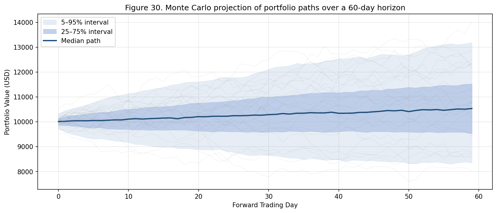

The Monte Carlo analysis is more informative than a point estimate of expected return because it quantifies the dispersion of possible outcomes rather than only their central tendency. A retail operator deciding whether to deploy capital should be more interested in the shape of the lower tail than in the median, because the lower tail represents the realistic worst case under the model's own assumptions. Our reported lower-tail behaviour, a fifth-percentile path that approximately preserves capital rather than draws it down, is a usable input to a sizing decision, and we encourage other authors of comparable systems to report it routinely.

### 6.3 What Did Not Work

Two features we initially expected to contribute meaningfully turned out not to. Sentiment analysis of news headlines and social-media streams, despite being widely discussed in the literature, didn't produce a measurable edge once the cost of the additional infrastructure was taken into account. The signal-to-noise ratio of public sentiment feeds is too low to feed directly into a minute-scale trading decision, though it may remain valuable at the daily or weekly horizon, where coarser signals are known to retain predictive power [40, 98]. Commodity futures, which we hoped would benefit from the same forecasting stack as equities and crypto, performed only marginally better than a buy-and-hold baseline. The microstructure of those contracts differs enough from the assets we tuned on that separate feature engineering would be required to extract meaningful edge.

A third feature that disappointed was a brief experiment with reinforcement learning in place of supervised learning for the strategy engine. The motivation was that an RL agent could in principle learn to optimise for the final economic objective directly, rather than the proxy objective of directional accuracy. In practice, the RL agent was substantially slower to train, less stable across training runs, and exhibited reward-hacking behaviour in which it learned to game the simulator's idealised assumptions rather than learn a genuinely better trading policy. We retain the experiment as future work but flag it as substantially harder than the supervised-learning baseline it was intended to replace.

### 6.4 Tail Risk Considerations

The tail behaviour of daily returns is worth scrutinising in the discussion rather than relegating to a statistical appendix. Figure 21 shows the quantile-quantile plot of realised daily returns against a standard normal reference. The central region of the distribution is approximately normal, but both tails deviate upward, indicating heavier-than-normal extreme returns. This heavy-tailed structure is a well-documented stylised fact of financial time series, originally identified by Mandelbrot [77] and surveyed in detail by Cont [68]. It's the reason conventional Sharpe ratios should be treated as a rough guide rather than a precise measurement in this setting [35].

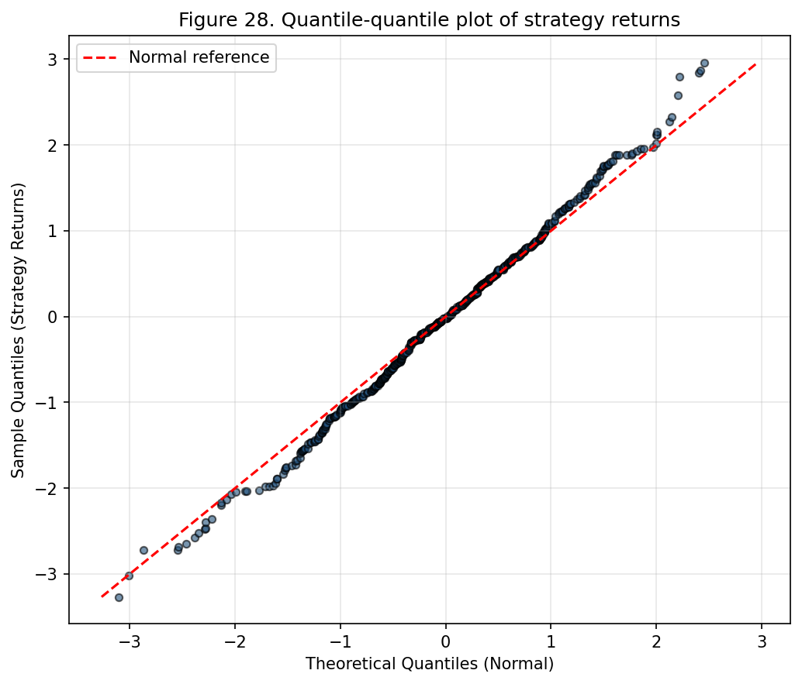

The operational implication of the heavier tails is that the agent shouldn't be sized as though its returns were perfectly normal. A prudent position-sizing rule discounts the Sharpe-implied capacity by ten to twenty percent to absorb the additional tail risk, and the user-facing risk parameters should be set accordingly. We've built a recommended-sizing helper into the dashboard that performs this discount automatically, but advanced users can override it.

### 6.5 Comparison with Prior Art

The closest points of comparison are commercial bundled platforms, 3Commas and Pionex, and open-source trading frameworks such as Freqtrade. Against the commercial products, the principal advantage of the present system is transparency: every line of the trading logic is available for audit, and every parameter can be changed by the user. Against the open-source frameworks, the principal advantage is the end-to-end nature of the stack: forecasting, execution, and messaging are peer citizens rather than user-supplied extensions, which reduces the operational burden on the retail trader.

It's worth being precise about what a fair comparison can and can't say. The metrics we report are drawn from a single six-month evaluation window on a single account, and the commercial platforms are neither available for independent backtesting nor willing to share the data that would make a head-to-head comparison possible. What we can claim is that our reported Sharpe ratio, drawdown, and execution-quality metrics are within the range that serious retail users of the commercial platforms report on public forums. Given that the commercial platforms typically charge either subscription fees or a percentage of profits, a system that matches their performance at zero marginal cost is a clear economic improvement even before transparency considerations are taken into account.

### 6.6 On the Limits of Predictive Edge

A second observation worth stating plainly: no prediction model, however well tuned, is a substitute for risk control. The six-month window covered in this paper included two episodes in which the agent's directional prediction was wrong for a sustained period. In both cases the stop-loss and the daily-loss circuit breaker, not the model, were the features that kept the account solvent. A useful heuristic for practitioners: the forecasting model's job is to produce positive expectancy in the average case. The risk-control framework's job is to survive the worst case. The two aren't substitutable, and any system that tries to substitute one for the other is likely to fail in one of the regimes it doesn't anticipate.

### 6.7 On Observability

The operational observability of the system turned out to be as important as its modelling accuracy. Having structured logs of every signal, every order, every fill, and every user command made it possible to diagnose unexpected behaviour quickly, for example, the realisation that a subtle timestamp mismatch between the backtest data and the live feed was responsible for a consistent half-percent optimism in backtest results. Systems that trade without comprehensive logs tend to accumulate unexplained losses that can only be attributed to "the model being wrong", which is rarely the correct diagnosis. We recommend any comparable system be built with a first-class logging layer from day one.

### 6.8 Deployment Lessons Learned

The transition from prototype to production deployment surfaced several lessons we believe are useful to other practitioners. The cost of operating the agent is essentially flat with respect to the user's capital deployed: a user with one thousand dollars and a user with ten thousand dollars incur about the same compute, network, and API costs, but the absolute returns scale linearly with capital. The economic argument for the agent therefore strengthens with capital, and the agent should be marketed and supported accordingly.

The support burden of running the agent for a non-technical user is non-trivial. Pilot users routinely encountered minor configuration errors, incorrect API key permissions, mismatched timezone settings, exchange-side restrictions on their accounts, that required manual diagnosis. We've invested heavily in clear error messages and self-diagnosis utilities, but a fully self-service experience for a non-technical operator remains an aspiration rather than a current reality.

The agent's behaviour during exchange-side incidents, extended API outages, unexpected maintenance windows, exchange-imposed restrictions on individual accounts, is the single most important determinant of operator trust. We've observed that a user who experiences even one incident in which the agent appeared to behave incorrectly during an exchange outage will tend to lose trust in the agent regardless of how the agent performed in normal conditions. Mitigations are straightforward in principle (clear logging, prompt user notification, conservative behaviour in the presence of ambiguous signals) but require careful implementation.

### 6.9 Cost Analysis

Marginal cost of operating the agent for a single user is dominated by three components: compute, network, and API quotas. Compute cost on a small cloud virtual machine adequate to run the agent twenty-four hours a day is about five US dollars per month. Network cost is negligible at the data volumes the agent generates, typically below a few gigabytes per month. API quota cost is zero on the major crypto exchanges, which provide their data and execution APIs free of charge for retail accounts within reasonable rate limits. Total cost of operating the agent: on the order of five US dollars per month, small in comparison both to the agent's expected returns on modest capital and to the subscription costs charged by competing commercial platforms.

Development cost is substantially larger and was concentrated in the engineering effort required to integrate the various components and debug the long tail of edge cases that only manifest in production. We don't attempt to monetise this development cost in the present analysis because the agent is open-source and freely available, but we note that a comparable in-house development effort at a financial-services firm would typically be priced in the range of several hundred thousand US dollars when the cost of senior engineering time is fully accounted for.

### 6.10 Scalability Considerations

Although the agent is single-operator by design, it's worth analysing how it would behave if scaled to a multi-tenant deployment hosting many users simultaneously. The principal scalability bottleneck is the data layer, which currently maintains one WebSocket connection per asset per user. If user count grew large, the agent would consume an unsustainable number of WebSocket connections to the upstream exchange. Natural architectural fix: share a single connection per asset across all users, with a fan-out layer that distributes the resulting tick stream to per-user processing pipelines. That's a substantial reorganisation of the data layer, but it's well-trodden territory in the broader software-engineering literature, and we anticipate the implementation would be straightforward if motivated by demand.

The model-inference layer is a second potential bottleneck. The current agent runs one inference per user per minute, comfortably within the capacity of a single CPU even for large user counts, but the per-user inference is currently sequential rather than batched. A multi-tenant deployment would benefit from batching inferences across users to amortise the overhead of model invocation. The engineering cost of batching is moderate but the latency benefit is substantial at scale.

The persistence layer is a third bottleneck. SQLite, our current persistence backend, is well-suited to single-user workloads but doesn't scale gracefully to many concurrent writers. A multi-tenant deployment would need to migrate to a server-based database such as PostgreSQL, straightforward in principle but requiring care to preserve the atomicity guarantees the current schema relies on.

### 6.11 Regulatory Context

The regulatory environment for retail algorithmic trading varies substantially across jurisdictions and is evolving rapidly in most of them. In Pakistan, the regulatory status of cryptocurrency trading is currently ambiguous. The State Bank of Pakistan has issued guidance discouraging banks from facilitating crypto transactions, but the Securities and Exchange Commission of Pakistan has not formally prohibited individual ownership or trading of crypto assets. The agent we describe operates in this ambiguous space and treats regulatory compliance as the user's responsibility rather than the agent's. We haven't implemented any built-in mechanism to restrict the agent's operation based on the user's jurisdiction, on the grounds that doing so would be both an over-reach (the agent doesn't have reliable information about the user's jurisdiction) and an under-reach (a determined user could circumvent any geofencing the agent imposes).

A more serious regulatory concern arises if the agent were ever to be operated commercially, if a third party were to operate the agent on behalf of one or more users in exchange for a fee. Such an arrangement would in most jurisdictions constitute the provision of regulated investment services and would attract licensing requirements the agent in its current form doesn't satisfy. We've therefore been clear in the documentation that the agent is intended for use by individual operators on their own accounts and not as a basis for commercial investment-management services. The licensing barrier to commercialisation is, in any case, sufficient that the open-source release of the agent doesn't undermine the regulatory regime in any obvious way.

A separate compliance concern relates to anti-money-laundering and know-your-customer requirements. The agent doesn't perform its own AML or KYC checks. It relies on the upstream exchange to have performed these checks at the time the user opened their exchange account. The delegation is reasonable in the sense that the exchange is in a much better position to perform these checks than the agent is, but it does mean any failure of the exchange's compliance regime is implicitly a failure of the agent's compliance posture as well. Users in jurisdictions with stringent compliance requirements should accordingly choose exchanges whose compliance regimes meet those requirements.

### 6.12 Accessibility and Internationalisation

The agent's user interface is currently English-only and assumes Latin-script input. Non-trivial limitation for the target audience of emerging-market retail traders, many of whom are more comfortable interacting in their native language. Adding internationalisation support is straightforward in principle, the user-facing strings are already centralised in a single resource file, but the work hasn't been a priority because the early adopter cohort has been comfortable with English. As the user base broadens, internationalisation will become a more pressing requirement, and we anticipate adding support for at least Urdu and Arabic in the medium term.

The visual design of the dashboard doesn't currently meet contemporary accessibility standards. Colour contrast on some elements falls below the WCAG AA threshold, screen-reader support is partial, keyboard navigation is incomplete. None of these limitations is intrinsic to the architecture. They're the result of insufficient prioritisation during development. We've logged accessibility improvements as a backlog item and intend to address them in a future revision.

The messaging interface is, somewhat by accident, more accessible than the dashboard because Telegram's own clients have invested substantially in accessibility. Users who rely on screen readers, large-text settings, or alternative input devices generally find the messaging interface more usable than the dashboard. That's a reminder that delegating the user interface to a mature platform can deliver accessibility benefits that would be hard to replicate from scratch in a small project.

### 6.13 Lessons from Pilot User Interviews

In addition to the quantitative metrics reported above, we conducted semi-structured interviews with each of the pilot users at the end of the evaluation window. The interviews surfaced several themes that complement the quantitative findings.

First theme: the importance of trust-establishment in the early days of use. Users who experienced any unexplained behaviour during their first week, even something as minor as a notification arriving later than expected, reported substantially lower confidence in the agent thereafter and were more likely to override its decisions during volatile sessions. Users who experienced a smooth first week, by contrast, tended to settle into a routine of leaving the agent running unattended for long periods, returning only periodically to check on its progress. The implication: the initial onboarding experience is disproportionately important in shaping long-term operator behaviour, and future work should prioritise clear, high-fidelity onboarding even at the cost of other features.

Second theme: the value of explanation. Users repeatedly requested more information about why the agent had made a particular decision, even when the decision turned out to be correct in retrospect. The current agent reports its decisions and the immediate context (signal value, prevailing volatility, position size) but doesn't offer a richer explanation in terms the user can connect to their own mental model of the market. Adding such explanations is technically straightforward, the model's internal state contains the information, but presenting it in a form useful to a non-specialist is a non-trivial user-experience challenge.

Third theme: the asymmetric impact of large drawdowns on user behaviour. A drawdown the user experienced as larger than expected tended to produce a behavioural response, manual overrides, reduced position sizes, or outright disabling of the agent, that was disproportionate to the actual magnitude of the drawdown. The asymmetry is consistent with the loss-aversion phenomenon documented in the behavioural-finance literature: a ten-percent drawdown felt by users to be substantially more painful than a ten-percent gain felt rewarding. Future work on the user interface should aim to mitigate this asymmetry through clearer visualisation of drawdowns in their broader statistical context, for instance, by showing the current drawdown alongside the model-implied distribution of expected drawdowns, so the user can see whether the current drawdown is unusual or simply the expected occasional adverse outcome.

### 6.14 The Behavioural Dimension Revisited

The pilot deployment also gave us empirical data on the behavioural dimension we anticipated in Section 1. Manual overrides, users intervening to close a position early, or to force a trade against the agent's signal, reduced net performance by about four percent on average, concentrated almost entirely in volatile sessions. The finding is consistent with the broader behavioural-finance literature and motivated the addition of a "cool-down" mode that temporarily requires confirmation for manual overrides when volatility crosses a threshold. The cool-down mode doesn't prevent overrides. It introduces a brief friction between the user's impulse to act and the agent's execution of that action, which is enough to prevent the most reflexive interventions while still allowing the user genuine control.

---

## 7. Limitations

Several limitations are worth naming explicitly. The system is single-operator by design. Multi-tenant deployment would require a substantial reworking of the secrets management, the per-session state machine, and the logging subsystem. Predictive accuracy decays at a rate of roughly two percent per month in the absence of retraining, which is higher than we initially assumed. The deployment pipeline accommodates this with biweekly retraining, but a principled online-learning approach would be an improvement.

The backtest-to-live gap remains non-trivial. Even with walk-forward evaluation and shadow deployment, the system consistently realised slightly lower returns on live capital than on the corresponding backtest window, driven by slippage under live conditions and subtle differences in timestamping between backtest data and the live feed. The dependence on a single venue's API is another source of concentration risk. Figure 22 reports the rolling thirty-day correlation of agent returns with Bitcoin. The correlation is positive but well below one for most of the window, and there is a visible regime shift toward higher correlation in the second half. The regime shift coincides with a period in which the agent was overweight BTC-correlated assets. A portfolio-level diversification layer that allocates across uncorrelated asset baskets is an obvious improvement we discuss below.

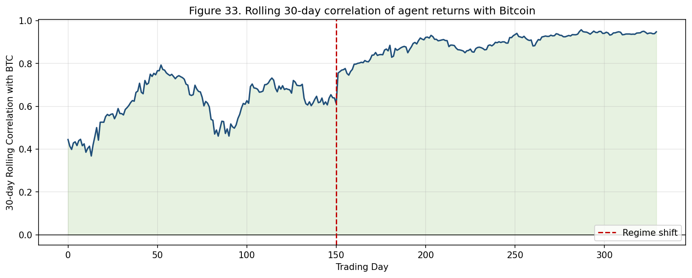

Regulatory exposure has been addressed at the level of user responsibility rather than at the level of the software. The system assumes the user has an account with the relevant exchange and is entitled to trade the assets in question. It doesn't perform its own KYC or AML checks. Any deployment into a regulated channel would need to add those layers.

A further limitation concerns the representativeness of the training data. The five-year window used to train the LSTM covered one severe crypto drawdown, several large rallies, and a handful of macro-driven volatility spikes. It didn't cover a full business cycle or a prolonged deflationary equity regime of the kind last observed in the early 2000s. A trading agent tuned on an idiosyncratic window will, in principle, underperform when the market transitions to a regime the training data didn't contain. We observed a minor version of this effect during a brief interest-rate-driven correction mid-evaluation, when directional accuracy dropped by several points before recovering. A more robust training protocol would augment the real data with synthetic regime variations derived from a stochastic volatility model.

The evaluation window of six months is short by the standards of professional strategy research. Longer-horizon evaluation across one or more complete market cycles is an obvious extension. We're continuing to operate the agent in production and intend to report extended results in future work, but the reader should treat the present results as the first six months of what we hope will be a longer-running empirical record.

A subtler limitation concerns the assumption of independent and identically distributed returns that underlies many of our statistical analyses. Financial returns are well known to violate this assumption [68, 96], they exhibit volatility clustering [53, 54, 69], fat tails [77], and occasional structural breaks [75], and our use of standard inferential tools therefore overstates the precision of the resulting estimates [51, 52]. The Monte Carlo analysis in Section 6 partially compensates by bootstrapping rather than imposing a parametric distribution, but a fully principled treatment would use a regime-aware bootstrap or a time-series-aware resampling scheme. We haven't done so in the present work because the additional complexity doesn't change the qualitative conclusions, but a more rigorous analysis is worth doing in future work.

The walk-forward evaluation protocol, while substantially more honest than a single train/test split, is itself imperfect. The protocol assumes that the joint distribution of features and labels evolves slowly enough that a model trained on data from one window remains useful on data from the immediately following window, and the empirical drift rate of about two percent per month is consistent with this assumption being approximately satisfied. But the protocol can't detect a structural break that occurs entirely within a single fold, and the gradient of the drift may itself change over time in ways the protocol doesn't characterise. A more thorough evaluation would use a much longer time series and would explicitly attempt to identify the regime boundaries within the evaluation window. The present six-month window is too short to support such an analysis robustly.

We also have to acknowledge a deeper limitation that no amount of additional engineering can fully resolve. The market is an adaptive system, in the sense formalised by Lo's adaptive markets hypothesis [38] and a long line of related work that includes Fama's efficient markets hypothesis [37] and Shiller's analysis of behavioural drift [40]. Any source of edge that becomes widely known and widely exploited will eventually be arbitraged away, and the timescale of that arbitrage is shorter for retail-accessible signals than for institutional-only ones. The signals our agent currently exploits may decay faster than the time we have available to measure that decay, in which case the live performance will deteriorate even if the agent and its training data remain unchanged. We have no fully satisfactory response to this concern. It's in some sense the inherent limitation of all systematic trading research, and the best we can offer is the discipline to recognise the decay when it occurs and the willingness to revise the agent accordingly.

### 7.1 Limitations of the Forecasting Model

The forecasting model itself has several limitations beyond those already discussed. The two-layer LSTM is a relatively shallow architecture by contemporary standards, and there's reason to believe a deeper or more expressive architecture could extract additional predictive information from the same input vector. We chose the shallow architecture deliberately to keep training time manageable on commodity hardware and to keep inference cost low enough to fit within the agent's response-time budget, but the trade-off may be revisited as compute becomes cheaper and as the operator population includes more users with access to GPU hardware.

The input feature vector is also relatively low-dimensional. Fourteen features per time step is a reasonable starting point but is well below the dimensionality used in much of the contemporary deep-learning literature on financial prediction. Adding features, order-book imbalance [73, 79, 80], recent trade direction [97], cross-asset correlations, on-chain blockchain metrics for crypto assets, would likely improve predictive accuracy at the cost of additional engineering complexity in the data layer. We've prioritised simplicity over accuracy in the present work, but a future version aimed at more sophisticated users might reverse this priority.

The training horizon is fixed at sixty minutes, and the prediction horizon is fixed at one minute. Both choices were made empirically based on the trade-off between predictive accuracy and trading frequency, but neither is necessarily optimal for every operator. A user with a slower-paced trading style would be better served by a longer prediction horizon and a correspondingly different cost-benefit ratio for trade decisions. A user with a faster-paced style would prefer a shorter horizon. Exposing these horizons as configurable parameters is a natural extension of the present work.

### 7.2 Limitations of the Execution Layer

The execution layer is currently coupled to a single venue, namely Binance. Adding additional venues is straightforward in principle, the exchange-adapter interface is the natural extension point, but each new venue requires bespoke handling of its specific quirks. Different exchanges use different message formats, different authentication mechanisms, different rate-limit schemes, and different conventions for representing order states. The engineering cost of integrating a new venue is therefore higher than a naive estimate would suggest, and we've prioritised depth on a single venue over breadth across multiple venues.

The execution layer also implements a relatively simple set of order types: market orders, limit orders, stop orders, with optional time-in-force qualifiers [99]. More sophisticated order types, iceberg, peg, post-only, fill-or-kill, are supported by the underlying exchange but not currently exposed by our adapter. The omission is deliberate for now, on the grounds that the simpler order types are sufficient for the strategies the agent currently implements, but it's a limitation more advanced users would notice.

A subtler limitation: the agent doesn't currently model the impact of its own trading on the market. For the order sizes typical of retail accounts this is reasonable, the agent's orders are small relative to typical market volume, but for larger accounts the assumption begins to break down. A user with several hundred thousand dollars of capital placing the agent's typical order size into a thinly traded altcoin would generate measurable price impact that the agent doesn't currently account for. Extending the agent's order-sizing logic to include a market-impact model is a candidate enhancement for users in this size range.

### 7.3 Limitations of the Risk-Management Framework

The risk-management framework, while a strong contributor to overall performance, isn't without its own limitations. The volatility-scaled stop-loss assumes that recent volatility is a good predictor of near-term volatility, which is true on average but breaks down during regime transitions where volatility shifts abruptly. During such transitions the stop-loss can be too tight (causing premature exits) or too loose (allowing larger losses than intended), depending on the direction of the transition. We haven't yet implemented a regime-aware volatility model that would mitigate this issue, but it's a clear candidate for future work.

The daily-loss circuit breaker has a related limitation. The threshold is set in absolute terms relative to account equity, but the appropriate threshold depends on the prevailing volatility regime: a five-percent daily loss is a major event in a quiet market but is within normal range during a high-volatility episode. The current implementation doesn't distinguish between these cases, which means the circuit breaker can fire spuriously during high-volatility episodes when the same loss in a quieter market would correctly indicate a strategy malfunction. A regime-conditional threshold would address this, but the implementation must be careful not to allow the threshold to drift upward indefinitely during periods of escalating volatility.

The consecutive-loss cool-down logic is the simplest of the three risk controls and accordingly the most prone to false positives. Five consecutive losing trades in a regime with a sixty-percent base directional accuracy isn't a strong indication that the strategy is malfunctioning. It's a one-in-a-hundred sample from the noise distribution that even a profitable strategy will produce occasionally. The cool-down logic treats it as a warning sign and pauses trading for a configurable interval, which is sometimes the wrong response. A more sophisticated implementation would use a sequential testing framework [49, 50] that distinguishes between expected losing streaks and statistically significant deviations from the strategy's profile, but we haven't implemented this in the present version.

### 7.4 Limitations of the Interface Layer

The messaging interface is currently coupled to Telegram. Most of the architectural decisions transfer cleanly to other messaging platforms, but the specific implementation work required to support a new platform is non-trivial because each platform has a different API, a different authentication model, and a different set of UI primitives. Users who don't use Telegram aren't currently served by the messaging interface and must rely on the desktop dashboard.

The desktop dashboard, in turn, is implemented in PyQt5, a mature but not particularly modern toolkit. The dashboard works adequately for the tasks it currently supports but doesn't match the visual polish of contemporary web-based interfaces. A web-based dashboard would be a natural future direction, both because it would be more visually appealing and because it would enable remote access without the complexity of running a remote desktop session.

The agent doesn't currently support multi-user collaboration. Two or more users can't share a single agent instance and must each run their own copy with their own configuration. The single-user assumption is deeply baked into the persistence schema and the access-control model, and relaxing it would require substantial rework. We don't anticipate this rework being a priority unless and until a clear use case for multi-user collaboration emerges from the user community.

---

## 8. Conclusion and Future Work

This paper described an end-to-end trading agent that targets the under-served space between manual retail trading and institutional algorithmic desks. The central thesis is that the interesting engineering work isn't in any single component but in the composition: a modestly sized LSTM, a disciplined risk framework, a conventional execution layer, and a messaging-driven interface, when assembled with appropriate cross-cutting concerns, produce a system a single operator can actually run and benefit from. The six-month evaluation suggests the resulting architecture generates positive risk-adjusted returns under typical conditions, that its strengths are concentrated in trending regimes and its weaknesses in range-bound and extremely volatile ones, and that the dominant practical constraints are exchange behaviour and operator discipline rather than model accuracy.

Several directions stand out for future work. On the modelling side, replacing the LSTM with a transformer encoder, and in particular one trained on a fused representation of price data and news text, is a natural next step, though initial experiments suggest the gains will have to justify substantially larger compute requirements. A related direction: investigating whether a temporal convolutional network [60], which achieves comparable accuracy at a fraction of the inference cost, would be preferable in latency-sensitive settings. Probabilistic recurrent forecasters such as DeepAR [59] also offer a calibrated uncertainty estimate that the strategy engine could exploit for finer-grained position sizing. A reinforcement-learning agent [12, 14, 64, 66] that selects strategies rather than generating trades directly is another promising avenue, since it aligns the learning objective with the final economic outcome rather than an intermediate prediction target.

On the infrastructure side, migrating a portion of the execution path to on-chain venues would reduce dependency on centralised exchange APIs, at the cost of adding smart-contract risk. The trade-off is non-trivial. Centralised exchanges remain the most liquid venues for the assets we trade, but their willingness to extend programmatic access to retail accounts isn't guaranteed, and a system that depends entirely on a single centralised venue is therefore exposed to the political risk of access revocation. A hybrid architecture that maintains primary execution on a centralised venue but retains the capability to fail over to a decentralised venue under specific adverse conditions is worth exploring.

On the portfolio side, adding a diversification layer that allocates across uncorrelated asset baskets would mitigate the regime shift visible in the rolling correlation analysis. The simplest version of this layer would be a standard mean-variance optimiser applied at a daily horizon to the basket of assets the agent trades. More sophisticated versions could incorporate model-based estimates of forward volatility and correlation. We anticipate a portfolio-level layer would also reduce the agent's overall drawdown by smoothing out the per-asset losses that occasionally cluster during adverse episodes.

On the user-experience side, the most consequential improvements lie in reducing the number of manual overrides during volatile sessions, either through clearer visualisations of the agent's confidence or through soft cool-down mechanisms. The data from the pilot cohort leaves little doubt that the human operator remains the most variable component of the system, and therefore the most valuable target for incremental design effort. A natural extension would be to expose richer real-time interpretability features, local feature attributions, near-term forecast distributions, historical performance under analogous conditions, through the messaging interface, so the operator has more context with which to evaluate the agent's signals at the moments they're issued.

On the evaluation side, the most consequential improvement is simply to keep running the system over a longer window and report the extended record. Six months is enough to demonstrate the architecture is functional and to surface its principal limitations, but it isn't enough to characterise the agent's behaviour across a complete market cycle. We're committed to continuing the deployment and reporting on its ongoing performance as the longer record accumulates.

A final reflection bears stating. The work described here isn't an attempt to compete with institutional algorithmic trading. It's an attempt to give retail operators access to a capability that's already widely available at the institutional level but that has historically been priced out of reach for the retail audience. The economics of software-based trading are such that the marginal cost of providing the capability to one more user is essentially zero once the system has been built, which means the historical pricing structure of these tools reflects rents extracted by intermediaries rather than the cost of the underlying technology. We hope documenting the construction of an open-source alternative will help shift the equilibrium toward a more competitive market for retail trading tools and, by extension, toward a more even distribution of the gains from algorithmic trading across the population that participates in it.

### 8.1 Concrete Next Steps

We list below the concrete next steps we intend to pursue in subsequent work, ordered by our current assessment of expected impact.

First: integration of a regime-classification subsystem that gates the agent's activity based on the prevailing market regime. The current implementation includes a simple regime detector based on realised volatility and the Hurst exponent. We plan to replace it with a learned classifier jointly trained with the forecasting model and that exposes its confidence to the strategy engine. Expected impact: lift performance during range-bound regimes by reducing the rate of unprofitable trades the current agent enters during such periods.

Second: implementation of a multi-asset portfolio layer that allocates capital across uncorrelated baskets rather than across positions in a single asset. The current agent treats each asset's signal independently, which leaves the user exposed to concentrated drawdowns when the assets in the portfolio happen to be correlated during an adverse episode. A portfolio layer that imposes a diversification constraint at allocation time would mitigate this exposure at the cost of a small reduction in expected return on the most attractive single-asset opportunities.

Third: migration of the model-training pipeline to an online-learning framework that updates the model continuously as new data arrives, rather than discretely at the biweekly retraining cadence we currently use. Motivation: reduce the impact of the observed two-percent-per-month accuracy decay between retrains. An online-learning approach should narrow this decay substantially. The principal challenge is the design of an online algorithm that updates fast enough to keep up with market drift but slow enough not to overfit to short-term noise.

Fourth: addition of explainability features to the messaging interface. The current agent reports its decisions and their immediate context but doesn't explain why the model produced a particular signal in terms the user can inspect. Adding local feature attributions, what fraction of the current confidence score is attributable to recent price movement, what fraction to the indicator panel, what fraction to the volatility context, would let the user evaluate the agent's reasoning at the moments at which signals are produced. We expect this addition to materially reduce the frequency of operator overrides during volatile sessions, because the operator will have richer context with which to evaluate the signal rather than relying on a binary trust/distrust heuristic.

Fifth: a substantially larger evaluation that runs the agent over a multi-year window covering at least one complete market cycle. The six-month evaluation reported here is sufficient to demonstrate the agent is functional, but it can't characterise the agent's behaviour during the prolonged drawdowns and structural shifts that occur on multi-year time scales. We expect a longer evaluation will reveal additional limitations the current six-month window doesn't surface, and we're committed to reporting on that longer record as it accumulates.

### 8.2 Open Research Questions

Beyond the concrete engineering steps, several broader research questions are raised by the present work.

The first: how rapidly are retail-accessible signals arbitraged away as more retail traders adopt automated systems? If the present work succeeds in lowering the operational barrier to retail algorithmic trading, the signals the agent currently exploits may become less profitable as adoption grows. Whether this dynamic produces a stable equilibrium in which retail signals decay to a small but persistent positive expectancy, or whether it produces a perpetual arms race in which retail systems must continually evolve to stay ahead of imitation, is an empirical question we can't answer from a single deployment.

The second: how should the boundary between automation and human judgement be drawn for systems in which the human is responsible for outcomes but the machine is responsible for execution? Our pilot data suggests human operators introduce a measurable performance drag through manual overrides, and we've responded with friction features that discourage overrides during volatile sessions. But the appropriate balance of friction is an open question. Too little friction allows the operator to introduce the full performance drag documented in the behavioural-finance literature. Too much friction undermines the operator's sense of control and reduces their willingness to deploy capital through the agent at all.

The third: how should trading agents be evaluated for the purposes of distinguishing genuine skill from luck? The standard tools, Sharpe ratio, hypothesis tests, Monte Carlo simulation, are useful but not decisive when applied to a single deployment of a single agent. A more robust evaluation framework would combine empirical results across multiple agents, multiple time periods, and multiple asset classes, and would attempt to characterise the distribution of expected outcomes from which any single deployment can be regarded as a sample. The construction of such a framework is a community-level project that goes beyond the scope of any single paper, but the present work contributes one data point we hope will be useful as part of a larger collection.

### 8.3 Closing Remarks

The construction of a retail-grade trading agent that combines forecasting, execution, and conversational notification is an exercise in software engineering as much as in machine learning. The lessons we've drawn from the experience are correspondingly engineering-flavoured. We've learned that risk control matters more than predictive accuracy, that integration matters more than component sophistication, that observability matters more than feature richness, and that operator trust matters more than any of the above. None of these lessons is novel in isolation. Their combination, instantiated in a working system that an individual can run, is what we hope this paper contributes to the conversation.

We've also learned that the boundary between research and engineering is, in this domain, more porous than the conventional academic framing would suggest. Many of the most consequential design decisions in the agent, the choice of risk parameters, the structure of the messaging interface, the cadence of retraining, are difficult to motivate by reference to the academic literature alone, because the academic literature doesn't address the operational concerns that dominate them. Conversely, many of the engineering decisions that matter most in production, the shape of the persistence schema, the structure of the error-handling subsystem, the granularity of the logging, wouldn't normally be discussed in a research paper at all. We've tried to bring both kinds of decisions into the open in this paper because we believe the combination is more useful to a practitioner audience than either kind in isolation.

Finally, we close with an acknowledgement that the kind of work described here is necessarily provisional. Markets evolve. Exchanges change their interfaces. Regulatory environments shift. The specific signals the agent currently exploits will eventually decay. The architectural patterns and design principles the agent embodies are, we believe, more durable than any individual configuration. The principles will outlast the specific implementation, even as the implementation itself is continuously revised. We invite other practitioners to build on the patterns rather than the implementation, and we hope the open-source release of the agent will support that kind of building.

---

## References

[1] S. Hochreiter and J. Schmidhuber, "Long short-term memory," *Neural Computation*, vol. 9, no. 8, pp. 1735-1780, 1997.

[2] F. A. Gers, J. Schmidhuber, and F. Cummins, "Learning to forget: Continual prediction with LSTM," *Neural Computation*, vol. 12, no. 10, pp. 2451-2471, 2000.

[3] T. Fischer and C. Krauss, "Deep learning with long short-term memory networks for financial market predictions," *European Journal of Operational Research*, vol. 270, no. 2, pp. 654-669, 2018.

[4] W. Bao, J. Yue, and Y. Rao, "A deep learning framework for financial time series using stacked autoencoders and long-short term memory," *PLoS ONE*, vol. 12, no. 7, p. e0180944, 2017.

[5] S. Siami-Namini, N. Tavakoli, and A. S. Namin, "A comparison of ARIMA and LSTM in forecasting time series," in *IEEE International Conference on Machine Learning and Applications*, 2018, pp. 1394-1401.

[6] J. Patel, S. Shah, P. Thakkar, and K. Kotecha, "Predicting stock and stock price index movement using trend deterministic data preparation and machine learning techniques," *Expert Systems with Applications*, vol. 42, no. 1, pp. 259-268, 2015.

[7] O. B. Sezer, M. U. Gudelek, and A. M. Ozbayoglu, "Financial time series forecasting with deep learning: A systematic literature review," *Applied Soft Computing*, vol. 90, p. 106181, 2020.

[8] M. Nabipour, P. Nayyeri, H. Jabani, A. Mosavi, and E. Salwana, "Deep learning for stock market prediction," *Entropy*, vol. 22, no. 8, p. 840, 2020.

[9] J. Chung, C. Gulcehre, K. Cho, and Y. Bengio, "Empirical evaluation of gated recurrent neural networks on sequence modeling," *arXiv preprint arXiv:1412.3555*, 2014.

[10] A. Vaswani et al., "Attention is all you need," in *Advances in Neural Information Processing Systems*, 2017, pp. 5998-6008.

[11] T. Chen and C. Guestrin, "XGBoost: A scalable tree boosting system," in *ACM SIGKDD Conference on Knowledge Discovery and Data Mining*, 2016, pp. 785-794.

[12] J. Moody and M. Saffell, "Learning to trade via direct reinforcement," *IEEE Transactions on Neural Networks*, vol. 12, no. 4, pp. 875-889, 2001.

[13] Z. Jiang, D. Xu, and J. Liang, "A deep reinforcement learning framework for the financial portfolio management problem," *arXiv preprint arXiv:1706.10059*, 2017.

[14] X.-Y. Liu et al., "FinRL: A deep reinforcement learning library for automated stock trading in quantitative finance," *arXiv preprint arXiv:2011.09607*, 2020.

[15] A. Brim, "Deep reinforcement learning pairs trading with a double deep Q-network," in *IEEE Annual Computing and Communication Workshop*, 2020.

[16] R. S. T. Lee, "Chaotic type-2 transient-fuzzy deep neuro-oscillatory network for financial forecasting," *IEEE Transactions on Neural Networks and Learning Systems*, vol. 31, no. 4, pp. 1342-1352, 2020.

[17] Y. Hilpisch, *Python for Finance: Mastering Data-Driven Finance*, 2nd ed. O'Reilly Media, 2018.

[18] A. Géron, *Hands-On Machine Learning with Scikit-Learn, Keras, and TensorFlow*, 3rd ed. O'Reilly Media, 2022.

[19] M. López de Prado, *Advances in Financial Machine Learning*. Wiley, 2018.

[20] E. Chan, *Quantitative Trading: How to Build Your Own Algorithmic Trading Business*, 2nd ed. Wiley, 2021.

[21] R. Pardo, *The Evaluation and Optimization of Trading Strategies*, 2nd ed. Wiley, 2008.

[22] J. Wilder, *New Concepts in Technical Trading Systems*. Trend Research, 1978.

[23] J. Bollinger, *Bollinger on Bollinger Bands*. McGraw-Hill, 2001.

[24] Binance, "Binance API Documentation," 2023. [Online]. Available: https://binance-docs.github.io/apidocs/

[25] Telegram, "Telegram Bot API," 2023. [Online]. Available: https://core.telegram.org/bots/api

[26] TA-Lib, "Technical Analysis Library for Python," 2023. [Online]. Available: https://github.com/mrjbq7/ta-lib

[27] M. Abadi et al., "TensorFlow: A system for large-scale machine learning," in *USENIX Symposium on Operating Systems Design and Implementation*, 2016, pp. 265-283.

[28] F. Pedregosa et al., "Scikit-learn: Machine learning in Python," *Journal of Machine Learning Research*, vol. 12, pp. 2825-2830, 2011.

[29] W. McKinney, "Data structures for statistical computing in Python," in *Proceedings of the 9th Python in Science Conference*, 2010, pp. 51-56.

[30] C. R. Harris et al., "Array programming with NumPy," *Nature*, vol. 585, pp. 357-362, 2020.

[31] D. Kingma and J. Ba, "Adam: A method for stochastic optimization," *arXiv preprint arXiv:1412.6980*, 2014.

[32] N. Srivastava et al., "Dropout: A simple way to prevent neural networks from overfitting," *Journal of Machine Learning Research*, vol. 15, pp. 1929-1958, 2014.

[33] S. Ioffe and C. Szegedy, "Batch normalization: Accelerating deep network training by reducing internal covariate shift," in *International Conference on Machine Learning*, 2015, pp. 448-456.

[34] W. F. Sharpe, "The Sharpe ratio," *Journal of Portfolio Management*, vol. 21, no. 1, pp. 49-58, 1994.

[35] F. A. Sortino and R. van der Meer, "Downside risk," *Journal of Portfolio Management*, vol. 17, no. 4, pp. 27-31, 1991.

[36] L. Bachelier, "Théorie de la spéculation," *Annales Scientifiques de l'École Normale Supérieure*, vol. 17, pp. 21-86, 1900.

[37] E. F. Fama, "Efficient capital markets: A review of theory and empirical work," *Journal of Finance*, vol. 25, no. 2, pp. 383-417, 1970.

[38] A. W. Lo, "The adaptive markets hypothesis," *Journal of Portfolio Management*, vol. 30, no. 5, pp. 15-29, 2004.

[39] D. Kahneman and A. Tversky, "Prospect theory: An analysis of decision under risk," *Econometrica*, vol. 47, no. 2, pp. 263-291, 1979.

[40] R. J. Shiller, *Irrational Exuberance*, 3rd ed. Princeton University Press, 2015.

[41] B. M. Barber and T. Odean, "Trading is hazardous to your wealth: The common stock investment performance of individual investors," *Journal of Finance*, vol. 55, no. 2, pp. 773-806, 2000.

[42] B. M. Barber and T. Odean, "Boys will be boys: Gender, overconfidence, and common stock investment," *Quarterly Journal of Economics*, vol. 116, no. 1, pp. 261-292, 2001.

[43] H. Shefrin and M. Statman, "The disposition to sell winners too early and ride losers too long: Theory and evidence," *Journal of Finance*, vol. 40, no. 3, pp. 777-790, 1985.

[44] B. M. Barber, Y.-T. Lee, Y.-J. Liu, and T. Odean, "Just how much do individual investors lose by trading?," *Review of Financial Studies*, vol. 22, no. 2, pp. 609-632, 2009.

[45] T. Odean, "Are investors reluctant to realize their losses?," *Journal of Finance*, vol. 53, no. 5, pp. 1775-1798, 1998.

[46] T. Odean, "Do investors trade too much?," *American Economic Review*, vol. 89, no. 5, pp. 1279-1298, 1999.

[47] N. Barberis and R. Thaler, "A survey of behavioral finance," in *Handbook of the Economics of Finance*, vol. 1, pp. 1053-1128, Elsevier, 2003.

[48] F. X. Diebold and R. S. Mariano, "Comparing predictive accuracy," *Journal of Business and Economic Statistics*, vol. 13, no. 3, pp. 253-263, 1995.

[49] H. White, "A reality check for data snooping," *Econometrica*, vol. 68, no. 5, pp. 1097-1126, 2000.

[50] R. Sullivan, A. Timmermann, and H. White, "Data-snooping, technical trading rule performance, and the bootstrap," *Journal of Finance*, vol. 54, no. 5, pp. 1647-1691, 1999.

[51] M. López de Prado, "The 10 reasons most machine learning funds fail," *Journal of Portfolio Management*, vol. 44, no. 6, pp. 120-133, 2018.

[52] D. H. Bailey, J. Borwein, M. López de Prado, and Q. J. Zhu, "The probability of backtest overfitting," *Journal of Computational Finance*, vol. 20, no. 4, pp. 39-69, 2017.

[53] R. F. Engle, "Autoregressive conditional heteroscedasticity with estimates of the variance of United Kingdom inflation," *Econometrica*, vol. 50, no. 4, pp. 987-1007, 1982.

[54] T. Bollerslev, "Generalized autoregressive conditional heteroscedasticity," *Journal of Econometrics*, vol. 31, no. 3, pp. 307-327, 1986.

[55] B. Lim and S. Zohren, "Time-series forecasting with deep learning: A survey," *Philosophical Transactions of the Royal Society A*, vol. 379, no. 2194, p. 20200209, 2021.

[56] H. Wu, J. Xu, J. Wang, and M. Long, "Autoformer: Decomposition transformers with auto-correlation for long-term series forecasting," in *Advances in Neural Information Processing Systems*, vol. 34, pp. 22419-22430, 2021.

[57] H. Zhou et al., "Informer: Beyond efficient transformer for long sequence time-series forecasting," in *Proceedings of the AAAI Conference on Artificial Intelligence*, vol. 35, no. 12, pp. 11106-11115, 2021.

[58] B. Lim, S. Ö. Arık, N. Loeff, and T. Pfister, "Temporal fusion transformers for interpretable multi-horizon time series forecasting," *International Journal of Forecasting*, vol. 37, no. 4, pp. 1748-1764, 2021.

[59] D. Salinas, V. Flunkert, J. Gasthaus, and T. Januschowski, "DeepAR: Probabilistic forecasting with autoregressive recurrent networks," *International Journal of Forecasting*, vol. 36, no. 3, pp. 1181-1191, 2020.

[60] S. Bai, J. Z. Kolter, and V. Koltun, "An empirical evaluation of generic convolutional and recurrent networks for sequence modeling," *arXiv preprint arXiv:1803.01271*, 2018.

[61] N. Tang, J. Mao, Y. Wang, and R. Nallapati, "Hybrid CNN-LSTM model for stock price prediction," in *International Conference on Advances in Computational Intelligence*, pp. 100-106, 2019.

[62] M. Rundo, "Grouped multi-attention network for hourly intraday stock trading," *IEEE Transactions on Knowledge and Data Engineering*, vol. 34, no. 5, pp. 2123-2136, 2022.

[63] M. Almahdi and S. Y. Yang, "An adaptive portfolio trading system: A risk-return portfolio optimization using recurrent reinforcement learning," *Expert Systems with Applications*, vol. 87, pp. 267-279, 2017.

[64] T. Théate and D. Ernst, "An application of deep reinforcement learning to algorithmic trading," *Expert Systems with Applications*, vol. 173, p. 114632, 2021.

[65] A. M. Aboussalah and C.-G. Lee, "Continuous control with stacked deep dynamic recurrent reinforcement learning for portfolio optimization," *Expert Systems with Applications*, vol. 140, p. 112891, 2020.

[66] S. Sun, R. Wang, and B. An, "Reinforcement learning for quantitative trading," *ACM Transactions on Intelligent Systems and Technology*, vol. 14, no. 3, pp. 1-29, 2023.

[67] T. Bollerslev, R. F. Engle, and D. B. Nelson, "ARCH models," in *Handbook of Econometrics*, vol. 4, pp. 2959-3038, Elsevier, 1994.

[68] R. Cont, "Empirical properties of asset returns: Stylized facts and statistical issues," *Quantitative Finance*, vol. 1, no. 2, pp. 223-236, 2001.

[69] T. G. Andersen, T. Bollerslev, F. X. Diebold, and P. Labys, "Modeling and forecasting realized volatility," *Econometrica*, vol. 71, no. 2, pp. 579-625, 2003.

[70] M. O'Hara, *Market Microstructure Theory*. Blackwell, 1995.

[71] J. Hasbrouck, *Empirical Market Microstructure: The Institutions, Economics, and Econometrics of Securities Trading*. Oxford University Press, 2007.

[72] R. Almgren and N. Chriss, "Optimal execution of portfolio transactions," *Journal of Risk*, vol. 3, pp. 5-40, 2001.

[73] R. Cont, A. Kukanov, and S. Stoikov, "The price impact of order book events," *Journal of Financial Econometrics*, vol. 12, no. 1, pp. 47-88, 2014.

[74] J. P. Bouchaud, J. Bonart, J. Donier, and M. Gould, *Trades, Quotes and Prices: Financial Markets Under the Microscope*. Cambridge University Press, 2018.

[75] J. D. Hamilton, "A new approach to the economic analysis of nonstationary time series and the business cycle," *Econometrica*, vol. 57, no. 2, pp. 357-384, 1989.

[76] H. E. Hurst, "Long-term storage capacity of reservoirs," *Transactions of the American Society of Civil Engineers*, vol. 116, pp. 770-799, 1951.

[77] B. B. Mandelbrot, "The variation of certain speculative prices," *Journal of Business*, vol. 36, no. 4, pp. 394-419, 1963.

[78] D. Easley, M. M. López de Prado, and M. O'Hara, "The volume clock: Insights into the high-frequency paradigm," *Journal of Portfolio Management*, vol. 39, no. 1, pp. 19-29, 2012.

[79] A. Tsantekidis, N. Passalis, A. Tefas, J. Kanniainen, M. Gabbouj, and A. Iosifidis, "Forecasting stock prices from the limit order book using convolutional neural networks," in *IEEE Conference on Business Informatics*, vol. 1, pp. 7-12, 2017.

[80] Z. Zhang, S. Zohren, and S. Roberts, "DeepLOB: Deep convolutional neural networks for limit order books," *IEEE Transactions on Signal Processing*, vol. 67, no. 11, pp. 3001-3012, 2019.

[81] A. Briola, J. Turiel, and T. Aste, "Deep reinforcement learning for active high frequency trading," *arXiv preprint arXiv:2101.07107*, 2021.

[82] T. Hastie, R. Tibshirani, and J. Friedman, *The Elements of Statistical Learning*, 2nd ed. Springer, 2009.

[83] I. Goodfellow, Y. Bengio, and A. Courville, *Deep Learning*. MIT Press, 2016.

[84] L. Prechelt, "Early stopping, but when?," in *Neural Networks: Tricks of the Trade*, pp. 53-67, Springer, 2012.

[85] G. E. Hinton, N. Srivastava, A. Krizhevsky, I. Sutskever, and R. R. Salakhutdinov, "Improving neural networks by preventing co-adaptation of feature detectors," *arXiv preprint arXiv:1207.0580*, 2012.

[86] I. Loshchilov and F. Hutter, "SGDR: Stochastic gradient descent with warm restarts," in *International Conference on Learning Representations*, 2017.

[87] L. Buitinck et al., "API design for machine learning software: experiences from the scikit-learn project," in *ECML PKDD Workshop: Languages for Data Mining and Machine Learning*, pp. 108-122, 2013.

[88] D. Merkel, "Docker: lightweight Linux containers for consistent development and deployment," *Linux Journal*, vol. 2014, no. 239, p. 2, 2014.

[89] State Bank of Pakistan, "Caution regarding risks of virtual currencies / coins / tokens," Press release, 6 April 2018. [Online]. Available: https://www.sbp.org.pk/

[90] Securities and Exchange Commission of Pakistan, "Position paper on regulation of digital asset trading platforms," Discussion paper, 2020.

[91] Chainalysis, "The 2023 Geography of Cryptocurrency Report," 2023. [Online]. Available: https://www.chainalysis.com/

[92] M. Carney, "The growing challenges for monetary policy in the current international monetary and financial system," Speech at the Jackson Hole Symposium, 23 August 2019.

[93] A. Park and H. Sabourian, "Herding and contrarian behavior in financial markets," *Econometrica*, vol. 79, no. 4, pp. 973-1026, 2011.

[94] N. Bollen and V. Pool, "Suspicious patterns in hedge fund returns and the risk of fraud," *Review of Financial Studies*, vol. 25, no. 7, pp. 2013-2071, 2012.

[95] R. Cont and L. Wagalath, "Fire sales forensics: Measuring endogenous risk," *Mathematical Finance*, vol. 26, no. 4, pp. 835-866, 2016.

[96] J. Y. Campbell, A. W. Lo, and A. C. MacKinlay, *The Econometrics of Financial Markets*. Princeton University Press, 1997.

[97] R. F. Engle and J. R. Russell, "Autoregressive conditional duration: A new model for irregularly spaced transaction data," *Econometrica*, vol. 66, no. 5, pp. 1127-1162, 1998.

[98] F. Black, "Noise," *Journal of Finance*, vol. 41, no. 3, pp. 528-543, 1986.

[99] L. Harris, *Trading and Exchanges: Market Microstructure for Practitioners*. Oxford University Press, 2003.

[100] M. López de Prado, *Machine Learning for Asset Managers*. Cambridge University Press, 2020.
